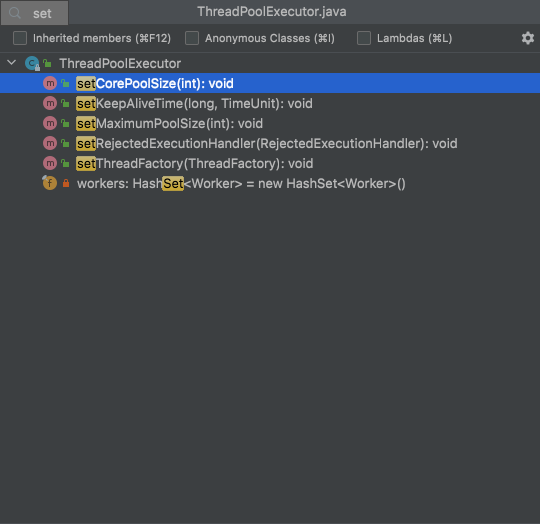

# 业务无侵入动态修改线程池核心参数的一种尝试

> **使用线程池 ThreadPoolExecutor 过程中的痛点** 
>
> 1.代码中创建了一个 `ThreadPoolExecutor`，但是不知道那几个核心参数设置多少比较合适 
>
> 2.凭经验设置参数值，上线后发现需要调整，改代码重启服务，非常麻烦 
>
> 3.线程池相对开发人员来说是个黑盒，运行情况不能及时感知到，直到出现问题
>
> **「背景」**
>
> - **「广泛性」**：在 Java 开发中，想要提高系统性能，线程池已经是一个 90%以上的人都会选择使用的基础工具
> - **「不确定性」**：项目中可能会创建很多线程池，既有 IO 密集型的，也有 CPU 密集型的，但线程池的参数并不好确定；需要有套机制在运行过程中动态去调整参数
> - **「无感知性」**：线程池运行过程中的各项指标一般感知不到；需要有套监控报警机制在事前、事中就能让开发人员感知到线程池的运行状况，及时处理
> - **「高可用性」**：配置变更需要及时推送到客户端；需要有高可用的配置管理推送服务，配置中心是现在大多数互联网系统都会使用的组件，与之结合可以大幅度减少开发量及接入难度

​			在java各种应用中存在大量线程池，即使没有使用过我们使用的tomcat、undertow、dubbo、netty等容器或中间件中也大量使用线程池。那有没有可能不停机的情况下修改线程池的一些核心参数呢？

​			直接跳过线程池的基础原理和各种核心参数的含义，「jdk原生线程池」已经为我们提供了设置几个核心参数的方法，支持运行时调整，虽然没有提供线程池队列的调整方法，也可以通过其他方式修改队列size。

​			所以实现这个操作只需要<font color=red>将应用中的线程池收集起来</font> 并通过rest或者注册-配置中心 展现在dashboard上，修改时dashboard通过rest或者注册-配置中心的watch机制下发到应用，应用收到这些事件调用原生线程池api就可以实现动态调整。

​			如果看过 `ThreadPoolExecutor` 的源码，大概可以知道它对核心参数基本都有提供 `set / get` 方法以及一些扩展方法，可以在运行时动态修改、获取相应的值。



​			大部分web应用都是spring 容器的，可以要求各产线使用线程池必须加入到spring 容器中，从基架层面写一个基于spring 线程池调整监控组件，用rest 或者 把应用线程池数据上传到注册-配置中心（例如：ETCD、Consul），当修改时通过rest或者配置中心watch机制监听并调用jdk 原生线程池api。

​			这种方案有局限性，只能收集spring 容器中的线程池，假如我们要收集当前应用所有的线程池，包含开发人员手动创建的没有纳入到spring容器中、非spring 应用中的、其他容器中间件例如web容器、dubbo、netty等中间件中创建的，并且对业务无感无侵入有没有办法收集到呢？

​			上java agent。java agent 又叫做 **java 探针** ，是java 提供了操作运行时字节码的机制，它可以实现虚拟机级别的AOP功能。Jdk1.5新增，相关类在 java.lang.instrument包下，通过[JVMTI](http://docs.oracle.com/javase/7/docs/platform/jvmti/jvmti.html)机制实现的。[JVMTI](http://docs.oracle.com/javase/7/docs/platform/jvmti/jvmti.html)全称JVM Tool Interface，是jvm暴露出来的一些供用户扩展的接口集合，JVMTI是基于事件驱动的，JVM每执行到一定的逻辑就会调用一些事件的回调接口（如果有的话），这些接口可以供开发者去扩展自己的逻辑。想深入了解java agent原理请转到你假笨 笨神博客之 [JVM源码分析之javaagent原理完全解读](http://lovestblog.cn/blog/2015/09/14/javaagent/)。

java agent的主要的功能如下：

- 可以在加载class文件之前做拦截把字节码做修改
  Skywalking、pinpoint分布式监控追踪、这次实现无侵入调整监控线程池demo都是用这个特性实现

-  可以在运行期将已经加载的类的字节码做变更
  Alibaba Arthas 、一些在线调试组件工具基本上使用的这个特性实现 

-  还有其他的一些小众的功能 

- - 获取所有已经被加载过的类

- - 获取所有已经被初始化过了的类（执行过了clinit方法，是上面的一个子集）

- - 获取某个对象的大小

- - 将某个jar加入到bootstrapclasspath里作为高优先级被bootstrapClassloader加载

- - 将某个jar加入到classpath里供AppClassloard去加载

- - 设置某些native方法的前缀，主要在查找native方法的时候做规则匹配

​			写agent当然少不了一个好用的 字节码工具 - ByteBuddy；Byte Buddy 是一个代码生成和操作库，用于在 Java 应用程序运行时创建和修改 Java 类，而无需编译器的帮助。除了 Java 类库附带的代码生成实用程序外，Byte Buddy 还允许创建任意类，并且不限于实现用于创建运行时代理的接口。此外，Byte Buddy 提供了一种方便的 API，可以使用 Java 代理或在构建过程中手动更改类。

​			准备就绪开始发车，下方即将出现大量代码。大概原理：在agent 中起一个 HttpServer监听查询和修改请求（demo减少三方依赖），生产级别可以将收集到的实例线程池信息上传到 ETCD、Consul等 注册-配置中心，然后通过对应的watch机制回调对应的应用并修改对应线程池信息，通过agent对线程池构造进行增强，创建线程池的时候将线程池增强并放到自定义容器中（就是一个Map），同时对其他线程池销毁进行增强，线程池销毁要从自定义容器移除。

​			***Talk is cheap, show me the code.***

<font color=red>agent 主类</font>

```java
public class ByteBuddyAgent {
    static HTTPServer server;
  	// agent入口
    public static void agentmain(String args, Instrumentation inst) {
        premain(args, inst);
    }
  	
    public static void premain(final String args, final Instrumentation instrumentation) {
        try {
            threadPoolExecutor(instrumentation);
            String host = "";
            Integer port = null;
            // 获取agent入参 HttpServer ip和端口号
            if(StringUtils.isNotEmpty(args)){
                String[] hosts = args.split(",");
                host = hosts[0];
                port = Integer.parseInt(hosts[1]);
            }

            initHttpServer(host,port);
        }catch (Exception e){
            e.printStackTrace();
        }
    }
  	// 初始化 HttpServer，查询和修改线程池信息，可通过agent 传入ip和端口
    private static void initHttpServer(String host,Integer port){
        try {
          	// 注册 线程调用栈查询请求 HttpServer处理
            new StackCollector().register();
          	// 注册 jvm信息查询请求 HttpServer处理
            new JVMCollector().register();
          	// 注册 线程池信息查询请求 HttpServer处理
            new ThreadPoolCollector().register();
          	// 注册 线程池修改请求 HttpServer处理
            new ThreadPoolModify().register();
            if(port == null){
                port = 8090;
            }
            if(StringUtils.isEmpty(host)) {
                host = InetAddrUtil.getHost();
            }
            InetSocketAddress socket = new InetSocketAddress(host, port);
            server = new HTTPServer(socket, CollectorRegistry.defaultRegistry, true);
            System.out.println(String.format("启动server：%s:%d",host,port ));
        } catch (Exception e) {
            e.printStackTrace();
        } finally {
        }
    }

    /**
     * 针对threadPoolExecutor 的增强
     * @param instrumentation
     */
    private static void threadPoolExecutor(Instrumentation instrumentation){
        new AgentBuilder.Default()
                .disableClassFormatChanges()
                .ignore(ElementMatchers.noneOf(ThreadPoolExecutor.class))
                .with(AgentBuilder.InitializationStrategy.NoOp.INSTANCE)
                //
                .with(AgentBuilder.RedefinitionStrategy.REDEFINITION)
                .with(AgentBuilder.TypeStrategy.Default.REDEFINE)
                .with(AgentBuilder.InjectionStrategy.UsingUnsafe.INSTANCE)
                .type(ElementMatchers.is(ThreadPoolExecutor.class))
                .transform((builder, typeDescription, classLoader, javaModule) ->
                        // 针对线程池销毁相关方法进行增强
                        builder.visit(Advice.to(ThreadPoolExecutorDestroyAdvice.class)
                                    .on(ElementMatchers.named("finalize")
                                    .or(ElementMatchers.named("shutdown")
                                    .or(ElementMatchers.named("shutdownNow")))))
                           // 针对线程池执行函数进行增强
                                .visit(Advice.to(ThreadPoolExecutorExecuteAdvice.class)
                                        .on(ElementMatchers.named("execute")))
                           // 针对构造函数进行增强
                                .visit(Advice.to(ThreadPoolExecutorConstructorAdvice.class)
                                        .on(ElementMatchers.isConstructor()))

                )
                .installOn(instrumentation);
    }

}
```

线程池构造增强：执行构造完成后将线程池加入到map容器中

ThreadPoolExecutorExecuteAdvice 和 ThreadPoolExecutorConstructorAdvice基本一样，没有加构造参数个数判断

<font color=red>ThreadPoolExecutorExecuteAdvice</font>

```java
public class ThreadPoolExecutorConstructorAdvice {
    @Advice.OnMethodExit
    public static void constructor(@Advice.This Object obj, @Advice.AllArguments Object[] args){
        try {
            if(null!= args && args.length==7){
                ThreadPoolExecutor executor = (ThreadPoolExecutor)obj;
                ThreadPoolMonitorData.add(executor);
            }
        } catch (Exception e) {
            e.printStackTrace();
        }
    }

}
```

线程池销毁增强：执行finalize、shutdown、shutdownNow相关方法是从map容器中移除

<font color=red>ThreadPoolExecutorDestroyAdvice</font>

```java
public class ThreadPoolExecutorDestroyAdvice {
    @Advice.OnMethodEnter
    public static void finalize(@Advice.This Object obj){
        ThreadPoolExecutor executor = (ThreadPoolExecutor) obj;
        ThreadPoolMonitorData.remove(executor);
    }

}
```

​			通过这几个增强类，当jar包运行时整个jar包中的所有线程池执行创建都会进入 agent定义的容器中，执行销毁会从容器中移除，通过 HttpServer 的ThreadPoolCollector处理获取收集到的线程池信息，通过ThreadPoolModify 处理修改线程池信息。ThreadPoolCollector就很简单循环收集到的线程池，将收集到的信息包装下返回。ThreadPoolCollector只需要从 map容器中获取对应的ThreadPoolExecutor，调用jdk原生提供的set相关方法就可以修改线程池核心参数

<font color=red>ThreadPoolCollector</font>

```java
// ThreadPoolCollector 获取线程池各种指标主要逻辑
public class ThreadPoolCollector extends Collector {
    public ThreadPoolCollector(){
        this.methodName = "threadPool";
    }
		@Override
    public ResultBean collect(Map<String,String> params) {
        Map<String, ThreadPoolExecutorWraper> alls = ThreadPoolMonitorData.alls();
        String key = params.get("key");
        ThreadPoolExecutorWraper executor = alls.get(key);
        // 如果能从 http请求中拿到对应的要查询的线程池信息直接返回对应的线程池信息
        // 如果不能就返回所有的线程池信息
        if(null != executor){
            ThreadPoolVo vo =  new ThreadPoolVo.Builder()
                    .name(executor.getName())
                    .desc(executor.getDesc())
                    .threadPoolExecutor(executor.getExecutor())
                    .build();
            return new ResultBean.Builder().success(vo).build();
        }
        Map<String,ThreadPoolVo> map = new HashMap<>();
        alls.forEach((k,v)->{
            ThreadPoolVo threadPoolVo =  new ThreadPoolVo.Builder()
                    .name(v.getName())
                    .desc(v.getDesc())
                    .threadPoolExecutor(v.getExecutor())
                    .build();
            map.put(k,threadPoolVo);
        });
        return new ResultBean.Builder().success(map).build();
    }
}
```

<font color=red>ThreadPoolModify:</font>

```java
// ThreadPoolModify 根据请求修改线程池核心参数核心逻辑
public class ThreadPoolModify extends Collector {
    public ThreadPoolModify(){
        this.methodName = "threadPool/modify";
    }
	@Override
    public ResultBean collect(Map<String,String> params) {
        try {
            Map<String, ThreadPoolExecutorWraper> alls = ThreadPoolMonitorData.alls();
            String key = params.get("key");
            String coreSize = params.getOrDefault("coreSize",null);
            String maximumPoolSize = params.getOrDefault("maximumPoolSize",null);
            ThreadPoolExecutorWraper executorWraper = null;
            if(StringUtils.isNotEmpty(key)){
                executorWraper = alls.get(key);
            }
            if(null == executorWraper){
                return new ResultBean.Builder().status("1000").message("没有找到对应的线程池").build();
            }
            ThreadPoolExecutor executor = executorWraper.getExecutor();
            if(StringUtils.isNotEmpty(coreSize) && StringUtils.isNumber(coreSize)){
                executor.setCorePoolSize(Integer.parseInt(coreSize));
            }
            if(StringUtils.isNotEmpty(maximumPoolSize) && StringUtils.isNumber(maximumPoolSize)){
                executor.setMaximumPoolSize(Integer.parseInt(maximumPoolSize));
            }
            //启动所有的核心线程数，getTask中不会根据核心线程数修改workers，如果再有新线程，会动态调整
            executor.prestartAllCoreThreads();
            //如果KeepAliveTime为0，不能修改
            if(executor.getKeepAliveTime(TimeUnit.MILLISECONDS)>0){
                //如果将线程池改小，设置下，默认核心线程数是不会回收的
                executor.allowCoreThreadTimeOut(true);
            }
            BlockingQueue<Runnable> queue = executor.getQueue();
            /**
             * TODO
             * 枚举BlockingQueue大小调整暂未实现，可通过反射修改队列的长度
             */
            ThreadPoolVo vo =  new ThreadPoolVo.Builder()
                    .name(executorWraper.getName())
                    .desc(executorWraper.getDesc())
                    .threadPoolExecutor(executorWraper.getExecutor())
                    .build();
            return new ResultBean.Builder().success(vo).build();
        } catch (Exception e) {
            e.printStackTrace();
        }
        return new ResultBean.Builder().fail(null).build();
    }
}
```

通过 ThreadPoolExecutor 直接可以获取到的线程池指标数据

```
  getActiveCount();获取当前活跃线程数
  getLargestPoolSize();获取历史峰值线程数
  getPoolSize();获取当前线程池中运行的线程总数
  getTaskCount();获取线程池总共执行过的任务数
  getCorePoolSize();获取核心线程数
  getCompletedTaskCount();获取线程池总共完成过的任务数
  getMaximumPoolSize();获取最大线程数
  getQueue().size();获取队列中没有被消费的数据数量
  getKeepAliveTime(); 获取线程最长的休眠时间
  isTerminating();调用 shutdown 或 shutdownnow 之后正在终止但尚未完全终止的过程中，则返回 true
  isTerminated();调用shutdown()方法后，并且所有提交的任务完成后返回为true，或者 调用shutdownNow()方法后，成功停止后返回为true;
  isShutdown();关闭标识，当调用shutdown()或shutdownNow()方法后返回为true
```

上spring boot空项目直接加上 -javaagent参数启动测试

查看收集到的线程池各种数据请求 ：http://localhost:8888/threadPool， 返回json可以看到收集到了tomcat 的线程池 org.apache.tomcat.util.threads.ThreadPoolExecutor@872592585 并且默认最大线程个数是 100，execute-pool-1 线程池是agent中 HttpServer运行所创建的

```json
请求返回结果：
{
    "message":"执行成功！",
    "status":"1",
    "data":{
        "java.util.concurrent.ScheduledThreadPoolExecutor@761680655":{
            "name":"java.util.concurrent.ScheduledThreadPoolExecutor@761680655",
            "desc":"未使用提供的NamedThreadFactory",
            "activeCount":0,
            "largestPoolSize":2,
            "poolSize":2,
            "taskCount":15,
            "corePoolSize":2,
            "completedTaskCount":9,
            "terminating":false,
            "maximumPoolSize":2147483647,
            "queueSize":6,
            "shutdown":false,
            "terminated":false
        },
        "java.util.concurrent.ThreadPoolExecutor@1242427797":{
            "name":"java.util.concurrent.ThreadPoolExecutor@1242427797",
            "desc":"未使用提供的NamedThreadFactory",
            "activeCount":0,
            "largestPoolSize":0,
            "poolSize":0,
            "taskCount":0,
            "corePoolSize":8,
            "completedTaskCount":0,
            "terminating":false,
            "maximumPoolSize":2147483647,
            "queueSize":0,
            "shutdown":false,
            "terminated":false
        },
        "java.util.concurrent.ThreadPoolExecutor@278240974":{
            "name":"java.util.concurrent.ThreadPoolExecutor@278240974",
            "desc":"未使用提供的NamedThreadFactory",
            "activeCount":1,
            "largestPoolSize":3,
            "poolSize":3,
            "taskCount":4,
            "corePoolSize":0,
            "completedTaskCount":3,
            "terminating":false,
            "maximumPoolSize":2147483647,
            "queueSize":0,
            "shutdown":false,
            "terminated":false
        },
        "execute-pool-1":{
            "name":"execute-pool-1",
            "desc":"default",
            "activeCount":1,
            "largestPoolSize":1,
            "poolSize":1,
            "taskCount":1,
            "corePoolSize":5,
            "completedTaskCount":0,
            "terminating":false,
            "maximumPoolSize":5,
            "queueSize":0,
            "shutdown":false,
            "terminated":false
        },
        "org.apache.tomcat.util.threads.ThreadPoolExecutor@872592585":{
            "name":"org.apache.tomcat.util.threads.ThreadPoolExecutor@872592585",
            "desc":"未使用提供的NamedThreadFactory",
            "activeCount":0,
            "largestPoolSize":10,
            "poolSize":10,
            "taskCount":0,
            "corePoolSize":10,
            "completedTaskCount":0,
            "terminating":false,
            "maximumPoolSize":100,
            "queueSize":0,
            "shutdown":false,
            "terminated":false
        },
        "java.util.concurrent.ScheduledThreadPoolExecutor@879583678":{
            "name":"java.util.concurrent.ScheduledThreadPoolExecutor@879583678",
            "desc":"未使用提供的NamedThreadFactory",
            "activeCount":0,
            "largestPoolSize":1,
            "poolSize":1,
            "taskCount":9,
            "corePoolSize":1,
            "completedTaskCount":0,
            "terminating":false,
            "maximumPoolSize":2147483647,
            "queueSize":9,
            "shutdown":false,
            "terminated":false
        }
    },
    "timestamp":1634025126818
}
```

修改线程池请求：http://localhost:8888/threadPool/modify?key=org.apache.tomcat.util.threads.ThreadPoolExecutor@872592585&coreSize=30&maximumPoolSize=300

修改请求返回的结果，修改最大线程数和核心线程数成功

```json

{
    "message":"执行成功！",
    "status":"1",
    "data":{
        "name":"org.apache.tomcat.util.threads.ThreadPoolExecutor@872592585",
        "desc":"未使用提供的NamedThreadFactory",
        "activeCount":0,
        "largestPoolSize":30,
        "poolSize":30,
        "taskCount":0,
        "corePoolSize":30,
        "completedTaskCount":0,
        "terminating":false,
        "maximumPoolSize":300,
        "queueSize":0,
        "shutdown":false,
        "terminated":false
    },
    "timestamp":1634025190666
}
```

开源项目参考：
 [dynamic-tp](https://github.com/dromara/dynamic-tp)
 [美团动态线程池实践思路开源框架（DynamicTp），监控及源码解析篇原创](https://heapdump.cn/article/3774520)
 [美团动态线程池](https://cloud.tencent.com/developer/article/2227890)
 [美团动态线程池实践思路，开源了](https://www.cnblogs.com/yanhom/p/15895335.html)


线程执行流程
