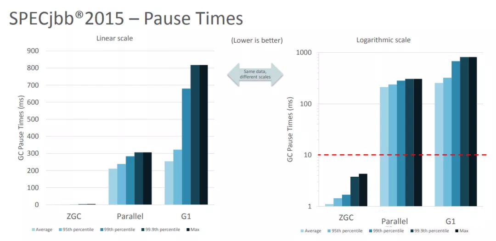

# Java 11 特性详解

## 基于嵌套的访问控制

在 Java 11 之前的版本中，编译之后的 class 文件中通过 InnerClasses 和 Enclosing Method
两种属性来帮助编译器确认源码的嵌套关系，每一个嵌套的类会编译到自己所在的 class 文件中，不同类的文件通过上面介绍的两种属性的来相互连接。
这两种属性对于编译器确定相互之间的嵌套关系已经足够了，但是并不适用于访问控制。

Java 11 中引入了两个新的属性：一个叫做 NestMembers 的属性，用于标识其它已知的静态 nest 成员；另外一个是每个 nest 成员都包含的
NestHost 属性， 用于标识出它的 nest 宿主类。

## 标准 HTTP Client 升级

Java 11 对 Java 9 中引入并在 Java 10 中进行了更新的 Http Client API 进行了标准化，在前两个版本中进行孵化的同时，Http
Client 几乎被完全重写，并且现在完全支持异步非阻塞。

新版 Java 中，Http Client 的包名由 jdk.incubator.http 改为 java.net.http，该 API 通过 CompleteableFutures
提供非阻塞请求和响应语义，可以联合使用以触发相应的动作，并且 RX Flo w 的概念也在 Java 11
中得到了实现。现在，在用户层请求发布者和响应发布者与底层套接字之间追踪数据流更容易了。这降低了复杂性，并最大程度上提高了
HTTP/1 和 HTTP/2 之间的重用的可能性。

Java 11 中的新 Http Client API，提供了对 HTTP/2 等业界前沿标准的支持，同时也向下兼容 HTTP/1.1，精简而又友好的 API 接口，与主流开源
API（如：Apache HttpClient、Jetty、OkHttp 等）类似甚至拥有更高的性能。与此同时它是 Java 在 Reactive-Stream 方面的第一个生产实践，其中广泛使用了
Java Flow API，终于让 Java 标准 HTTP 类库在扩展能力等方面，满足了现代互联网的需求，是一个难得的现代 Http/2 Client API
标准的实现，Java 工程师终于可以摆脱老旧的 HttpURLConnection 了。下面模拟 Http GET 请求并打印返回内容：

```agsl
 HttpClient client = HttpClient.newHttpClient();
    HttpRequest request = HttpRequest.newBuilder()
          .uri(URI.create("http://openjdk.java.net/"))
          .build();
    client.sendAsync(request, BodyHandlers.ofString())
          .thenApply(HttpResponse::body)
          .thenAccept(System.out::println)
          .join();
```

## Epsilon：低开销垃圾回收器

Epsilon 垃圾回收器的目标是开发一个控制内存分配，但是不执行任何实际的垃圾回收工作。它提供一个完全消极的 GC
实现，分配有限的内存资源，最大限度的降低内存占用和内存吞吐延迟时间。

Java 版本中已经包含了一系列的高度可配置化的 GC 实现。各种不同的垃圾回收器可以面对各种情况。但是有些时候使用一种独特的实现，而不是将其堆积在其他
GC 实现上将会是事情变得更加简单。

* 下面是 no-op GC 的几个使用场景：

1. 性能测试：什么都不执行的 GC 非常适合用于 GC 的差异性分析。no-op （无操作）GC 可以用于过滤掉 GC 诱发的性能损耗，比如 GC
   线程的调度，GC 屏障的消耗，GC 周期的不合适触发，内存位置变化等。此外有些延迟者不是由于 GC 引起的，比如 scheduling hiccups,
   compiler transition hiccups，所以去除 GC 引发的延迟有助于统计这些延迟。
2. 内存压力测试：在测试 Java 代码时，确定分配内存的阈值有助于设置内存压力常量值。这时 no-op
   就很有用，它可以简单地接受一个分配的内存分配上限，当内存超限时就失败。例如：测试需要分配小于 1G 的内存，就使用-Xmx1g 参数来配置
   no-op GC，然后当内存耗尽的时候就直接 crash。
3. VM 接口测试：以 VM 开发视角，有一个简单的 GC 实现，有助于理解 VM-GC 的最小接口实现。它也用于证明 VM-GC 接口的健全性。
4. 极度短暂 job 任务：一个短声明周期的 job 任务可能会依赖快速退出来释放资源，这个时候接收 GC 周期来清理 heap 其实是在浪费时间，因为
   heap 会在退出时清理。并且 GC 周期可能会占用一会时间，因为它依赖 heap
   上的数据量。延迟改进：对那些极端延迟敏感的应用，开发者十分清楚内存占用，或者是几乎没有垃圾回收的应用，此时耗时较长的 GC
   周期将会是一件坏事。
5. 吞吐改进：即便对那些无需内存分配的工作，选择一个 GC 意味着选择了一系列的 GC 屏障，所有的 OpenJDK GC
   都是分代的，所以他们至少会有一个写屏障。避免这些屏障可以带来一点点的吞吐量提升。

Epsilon 垃圾回收器和其他 OpenJDK 的垃圾回收器一样，可以通过参数 -XX:+UseEpsilonGC 开启。

Epsilon 线性分配单个连续内存块。可复用现存 VM 代码中的 TLAB 部分的分配功能。非 TLAB 分配也是同一段代码，因为在此方案中，分配
TLAB 和分配大对象只有一点点的不同。Epsilon 用到的 barrier 是空的(或者说是无操作的)。因为该 GC 执行任何的 GC
周期，不用关系对象图，对象标记，对象复制等。引进一种新的 barrier-set 实现可能是该 GC 对 JVM 最大的变化。

### 简化启动单个源代码文件的方法

Java 11 版本中最令人兴奋的功能之一是增强 Java 启动器，使之能够运行单一文件的 Java 源代码。此功能允许使用 Java 解释器直接执行
Java 源代码。源代码在内存中编译，然后由解释器执行。唯一的约束在于所有相关的类必须定义在同一个 Java 文件中。

如今单文件程序在编写小实用程序时很常见，特别是脚本语言领域。从中开发者可以省去用 Java 编译程序等不必要工作，以及减少新手的入门障碍。在基于
Java 10 的程序实现中可以通过三种方式启动：

1. 作为 * .class 文件
2. 作为 * .jar 文件中的主类
3. 作为模块中的主类

```agsl
$ java HelloWorld.java
```

等同于

```agsl
$ javac HelloWorld.java
$ java -cp . hello.World
```

## 用于 Lambda 参数的局部变量语法

```agsl
@Nonnull var x = new Foo();
(@Nonnull var x, @Nullable var y) -> x.process(y)
```

## 低开销的 Heap Profiling

Java 11 中提供一种低开销的 Java 堆分配采样方法，能够得到堆分配的 Java 对象信息，并且能够通过 JVMTI 访问堆信息。

引入这个低开销内存分析工具是为了达到如下目的：

1. 足够低的开销，可以默认且一直开启
2. 能通过定义好的程序接口访问
3. 能够对所有堆分配区域进行采样
4. 能给出正在和未被使用的 Java 对象信息

## 支持 TLS 1.3 协议

Java 11 中包含了传输层安全性（TLS）1.3 规范（RFC 8446）的实现，替换了之前版本中包含的 TLS，包括 TLS 1.2，同时还改进了其他 TLS
功能，例如 OCSP 装订扩展（RFC 6066，RFC 6961），以及会话散列和扩展主密钥扩展（RFC 7627），在安全性和性能方面也做了很多提升。

升级到 TLS 1.3 之前，需要考虑如下几个兼容性问题：

1. TLS 1.3 使用半关闭策略，而 TLS 1.2 以及之前版本使用双工关闭策略，对于依赖于双工关闭策略的应用程序，升级到 TLS 1.3
   时可能存在兼容性问题。
2. TLS 1.3 使用预定义的签名算法进行证书身份验证，但实际场景中应用程序可能会使用不被支持的签名算法。
3. TLS 1.3 再支持 DSA 签名算法，如果在服务器端配置为仅使用 DSA 证书，则无法升级到 TLS 1.3。
4. TLS 1.3 支持的加密套件与 TLS 1.2 和早期版本不同，若应用程序硬编码了加密算法单元，则在升级的过程中需要修改相应代码才能升级使用
   TLS 1.3。
5. TLS 1.3 版本的 session 用行为及秘钥更新行为与 1.2 及之前的版本不同，若应用依赖于 TLS 协议的握手过程细节，则需要注意

## ZGC：可伸缩低延迟垃圾收集器

ZGC 即 Z Garbage Collector（垃圾收集器或垃圾回收器），这应该是 Java 11 中最为瞩目的特性，没有之一。ZGC
是一个可伸缩的、低延迟的垃圾收集器，主要为了满足如下目标进行设计：

1. GC 停顿时间不超过 10ms
2. 即能处理几百 MB 的小堆，也能处理几个 TB 的大堆
3. 应用吞吐能力不会下降超过 15%（与 G1 回收算法相比）
4. 方便在此基础上引入新的 GC 特性和利用 colord
5. 针以及 Load barriers 优化奠定基础
6. 当前只支持 Linux/x64 位平台 停顿时间在 10ms 以下，10ms 其实是一个很保守的数据，即便是 10ms 这个数据，也是 GC
   调优几乎达不到的极值。根据 SPECjbb 2015 的基准测试，128G 的大堆下最大停顿时间才 1.68ms，远低于 10ms，和 G1 算法相比，改进非常明显。


本图片引用自：The Z Garbage Collector – An Introduction

目前只在 Linux/x64 上可用，如果有足够的需求，将来可能会增加对其他平台的支持。同时作为实验性功能的 ZGC 将不会出现在 JDK
构建中，除非在编译时使用 configure 参数：--with-jvm-features=zgc 显式启用。

```agsl
-XX：+ UnlockExperimentalVMOptions -XX：+ UseZGC -Xmx10g
```

## 飞行记录器

Java 语言中的飞行记录器类似飞机上的黑盒子，是一种低开销的事件信息收集框架，主要用于对应用程序和 JVM
进行故障检查、分析。飞行记录器记录的主要数据源于应用程序、JVM 和 OS，这些事件信息保存在单独的事件记录文件中，故障发生后，能够从事件记录文件中提取出有用信息对故障进行分析。

启用飞行记录器参数如下：

```agsl
-XX:StartFlightRecording
```

```agsl
java -XX:StartFlightRecording=duration=1s, filename=recording.jfr
```

## 动态类文件常量

Java 的第七个版本已将 invokedynamic 引入其指令集。

Java 开发人员通常不会注意到此功能，因为它隐藏在 Java 字节代码中。通过使用 invokedynamic，可以延迟方法调用的绑定，直到第一次调用。例如，Java
语言使用该技术来实现 Lambda 表达式，这些表达式仅在首次使用时才显示出来。这样做，invokedynamic 已经演变成一种必不可少的语言功能。

# Java 12 新特详解

## Shenandoah：一个低停顿垃圾收集器（实验阶段）

Java 12 中引入一个新的垃圾收集器：Shenandoah，它是作为一中低停顿时间的垃圾收集器而引入到 Java 12 中的，其工作原理是通过与
Java 应用程序中的执行线程同时运行，用以执行其垃圾收集、内存回收任务，通过这种运行方式，给虚拟机带来短暂的停顿时间。

## 增加一套微基准套件

Java 12 中添加一套新的基本的微基准测试套件，该套微基准测试套件基于 JMH（Java Microbenchmark
Harness），使开发人员可以轻松运行现有的微基准测试并创建新的基准测试，其目标在于提供一个稳定且优化过的基准，其中包括将近 100
个基准测试的初始集合，并且能够轻松添加新基准、更新基准测试和提高查找已有基准测试的便利性。

## Switch 表达式扩展（预览功能）

```agsl
int dayNumber = switch (day) {
    case MONDAY, FRIDAY, SUNDAY -> 6;
    case TUESDAY                -> 7;
    case THURSDAY, SATURDAY     -> 8;
    case WEDNESDAY              -> 9;
    default                      -> throw new IllegalStateException("Huh? " + day);
}
```

使用 Java 12 中 Switch 表达式的写法，省去了 break 语句，避免了因少些 break 而出错，同时将多个 case
合并到一行，显得简洁、清晰也更加优雅的表达逻辑分支，其具体写法就是将之前的 case 语句表成了：case L ->，即如果条件匹配 case
L，则执行 标签右侧的代码 ，同时标签右侧的代码段只能是表达式、代码块或 throw 语句。为了保持兼容性，case
条件语句中依然可以使用字符 : ，这时 fall-through 规则依然有效的，即不能省略原有的 break 语句，但是同一个 Switch
结构里不能混用 -> 和 : ，否则会有编译错误。并且简化后的 Switch 代码块中定义的局部变量，其作用域就限制在代码块中，而不是蔓延到整个
Switch 结构，也不用根据不同的判断条件来给变量赋值。

## 引入 JVM 常量 API

Java 12 中引入 JVM 常量 API，用来更容易地对关键类文件 (key class-file) 和运行时构件（artefact）的名义描述 (nominal
description) 进行建模，特别是对那些从常量池加载的常量，这是一项非常技术性的变化，能够以更简单、标准的方式处理可加载常量。

## 改进 AArch64 实现 && 使用默认类数据共享（CDS）存档

## 改善 G1 垃圾收集器，使其能够中止混合集合

Java 12 中将把 GC 回收集（混合收集集合）拆分为必需和可选两部分，使 G1 垃圾回收器能中止垃圾回收过程。其中必需处理的部分包括
G1 垃圾收集器不能递增处理的 GC 回收集的部分（如：年轻代），同时也可以包含老年代以提高处理效率。将 GC 回收集拆分为必需和可选部分时，需要为可选
GC 回收集部分维护一些其他数据，这会产生轻微的 CPU 开销，但小于 1 ％的变化，同时在 G1 回收器处理 GC
回收集期间，本机内存使用率也可能会增加，使用上述情况只适用于包含可选 GC 回收部分的 GC 混合回收集合。

在 G1 垃圾回收器完成收集需要必需回收的部分之后，便开始收集可选的部分，如果还有时间的话，但是粗粒度的处理，可选部分的处理粒度取决于剩余的时间，一次只能处理可选部分的一个子集区域。在完成可选收集部分的收集后，G1
垃圾回收器可以根据剩余时间决定是否停止收集。如果在处理完 必需处理的 部分后，属于时间不足，总时间花销接近预期时间，G1
垃圾回收器也可以中止可选部分的回收以达到满足预期停顿时间的目标。

## 增强 G1 垃圾收集器，使其能自动返回未用堆内存给操作系统

目前 Java 11 版本中包含的 G1 垃圾收集器 暂时无法及时将已提交的 Java 堆内存返回给操作系统， G1 垃圾收集器仅在进行完整 GC (
Full GC) 或并发处理周期时才能将 Java 堆返回内存。由于 G1 回收器尽可能避免完整 GC，并且只触发基于 Java
堆占用和分配活动的并发周期，因此在许多情况下 G 1 垃圾回收器不能回收 Java 堆内存，除非有外部强制执行。

在使用云平台的容器环境中，这种不利之处特别明显。即使在虚拟机不活动，但如果仍然使用其分配的内存资源，哪怕是其中的一小部分，G1
回收器也仍将保留所有已分配的 Java 堆内存。而这将导致用户需要始终为所有资源付费，哪怕是实际并未用到，而云提供商也无法充分利用其硬件。如果在次期间虚拟机能够检测到
Java 堆内存的实际使用情况，并在利用空闲时间自动将 Java 堆内存返还，则两者都将受益。

为了尽可能的向操作系统返回空闲内存，G1 垃圾收集器将在应用程序不活动期间定期生成或持续循环检查整体 Java 堆使用情况，以便 G
1 垃圾收集器能够更及时的将 Java 堆中不使用内存部分返还给操作系统。对于长时间处于空闲状态的应用程序，此项改进将使 JVM
的内存利用率更加高效。

如果应用程序为非活动状态，在下面两种情况下，G1 回收器会触发定期垃圾收集：

自上次垃圾回收完成 以来已超过 G1PeriodicGCInterva l 毫秒， 并且此时没有正在进行的垃圾回收任务。如果 G1PeriodicGCInterval
值为零表示禁用快速回收内存的定期垃圾收集。应用所在主机系统上执行方法 getloadavg()，一分钟内系统返回的平均负载值低于
G1PeriodicGCSystemLoadThreshold。如果 G1PeriodicGCSystemLoadThreshold 值为零，则此条件不生效。如果不满足上述条件中的任何一个，则取消当期的定期垃圾回收。等一个
G1PeriodicGCInterval 时间周期后，将重新考虑是否执行定期垃圾回收。

G1 定期垃圾收集的类型根据 G1PeriodicGCInvokesConcurrent 参数的值确定：如果设置值了，G1 垃圾回收器将继续上一个或者启动一个新并发周期；如果没有设置值，则
G1 回收器将执行一个完整的 GC。在每次一次 GC 回收末尾，G1 回收器将调整当前的 Java 堆大小，此时便有可能会将未使用内存返还给操作系统。新的
Java 堆内存大小根据现有配置确定，具体包括下列配置：- XX:MinHeapFreeRatio、-XX:MaxHeapFreeRatio、-Xms、-Xmx。

默认情况下，G1 回收器在定期垃圾回收期间新启动或继续上一轮并发周期，将最大限度地减少应用程序的中断。如果定期垃圾收集严重影响程序执行，则需要考虑整个系统
CPU 负载，或让用户禁用定期垃圾收集。

# Java 13 特性详解

## 动态应用程序类-数据共享

在 Java 10 中，为了改善应用启动时间和内存空间占用，通过使用 APP CDS，加大了 CDS 的使用范围，允许自定义的类加载器也可以加载自定义类给多个
JVM 共享使用.

Java 13 中对 Java 10 中引入的 应用程序类数据共享进行了进一步的简化、改进和扩展，即：允许在 Java
应用程序执行结束时动态进行类归档，具体能够被归档的类包括：所有已被加载，但不属于默认基层 CDS
的应用程序类和引用类库中的类。通过这种改进，可以提高应用程序类-数据使用上的简易性，减少在使用类-数据存档中需要为应用程序创建类加载列表的必要，简化使用类-数据共享的步骤，以便更简单、便捷地使用
CDS 存档。

在 Java 中，如果要执行一个类，首先需要将类编译成对应的字节码文件，以下是 JVM 装载、执行等需要的一系列准备步骤：假设给定一个类名，JVM
将在磁盘上查找到该类对应的字节码文件，并将其进行加载，验证字节码文件，准备，解析，初始化，根据其内部数据结构加载到内存中。当然，这一连串的操作都需要一些时间，这在
JVM 启动并且需要加载至少几百个甚至是数千个类时，加载时间就尤其明显。

Java 10 中的 App CDS 主要是为了将不变的类数据，进行一次创建，然后存储到归档中，以便在应用重启之后可以对其进行内存映射而直接使用，同时也可以在运行的
JVM 实例之间共享使用。但是在 Java 10 中使用 App CDS 需要进行如下操作：

1. 创建需要进行类归档的类列表
2. 创建归档
3. 使用归档方式启动

在使用归档文件启动时，JVM 将归档文件映射到其对应的内存中，其中包含所需的大多数类，而

需要使用多么复杂的类加载机制。甚至可以在并发运行的 JVM 实例之间共享内存区域，通过这种方式可以释放需要在每个 JVM
实例中创建相同信息时浪费的内存，从而节省了内存空间。

在 Java 12 中，默认开启了对 JDK 自带 JAR 包类的存档，如果想关闭对自带类库的存档，可以在启动参数中加上：

```agsl
-Xshare:off
```

而在 Java 13 中，可以不用提供归档类列表，而是通过更简洁的方式来创建包含应用程序类的归档。具体可以使用参数 -XX:
ArchiveClassesAtExit 来控制应用程序在退出时生成存档，也可以使用 -XX:SharedArchiveFile 来使用动态存档功能，详细使用见如下示例。

## 增强 ZGC 释放未使用内存

ZGC 是 Java 11 中引入的最为瞩目的垃圾回收特性，是一种可伸缩、低延迟的垃圾收集器，不过在 Java 11 中是实验性的引入，主要用来改善
GC 停顿时间，并支持几百 MB 至几个 TB 级别大小的堆，并且应用吞吐能力下降不会超过 15%，目前只支持 Linux/x64 位平台的这样一种新型垃圾收集器。

通过在实际中的使用，发现 ZGC 收集器中并没有像 Hotspot 中的 G1 和 Shenandoah 垃圾收集器一样，能够主动将未使用的内存释放给操作系统的功能。对于大多数应用程序来说，CPU
和内存都属于有限的紧缺资源，特别是现在使用的云上或者虚拟化环境中。如果应用程序中的内存长期处于空闲状态，并且还不能释放给操作系统，这样会导致其他需要内存的应用无法分配到需要的内存，而这边应用分配的内存还处于空闲状态，处于”忙的太忙，闲的太闲”的非公平状态，并且也容易导致基于虚拟化的环境中，因为这些实际并未使用的资源而多付费的情况。由此可见，将未使用内存释放给系统主内存是一项非常有用且亟需的功能。

ZGC 堆由一组称为 ZPages 的堆区域组成。在 GC 周期中清空 ZPages 区域时，它们将被释放并返回到页面缓存 ZPageCache 中，此缓存中的
ZPages 按最近最少使用（LRU）的顺序，并按照大小进行组织。在 Java 13 中，ZGC
将向操作系统返回被标识为长时间未使用的页面，这样它们将可以被其他进程重用。同时释放这些未使用的内存给操作系统不会导致堆大小缩小到参数设置的最小大小以下，如果将最小和最大堆大小设置为相同的值，则不会释放任何内存给操作系统。

Java 13 中对 ZGC 的改进，主要体现在下面几点：

1. 释放未使用内存给操作系统
2. 支持最大堆大小为 16TB
3. 添加参数：-XX:SoftMaxHeapSize 来软限制堆大小

这里提到的是软限制堆大小，是指 GC 应努力是堆大小不要超过指定大小，但是如果实际需要，也还是允许 GC 将堆大小增加到超过
SoftMaxHeapSize 指定值。主要用在下面几种情况：当希望降低堆占用，同时保持应对堆空间临时增加的能力，亦或想保留充足内存空间，以能够应对内存分配，而不会因为内存分配意外增加而陷入分配停滞状态。不应将
SoftMaxHeapSize 设置为大于最大堆大小（-Xmx 的值，如果未在命令行上设置，则此标志应默认为最大堆大小。

Java 13 中，ZGC 内存释放功能，默认情况下是开启的，不过可以使用参数：-XX：-ZUncommit 显式关闭，同时如果将最小堆大小 (-Xms)
配置为等于最大堆大小 (-Xmx)，则将隐式禁用此功能。

还可以使用参数：-XX：ZUncommitDelay = <seconds>（默认值为 300 秒）来配置延迟释放，此延迟时间可以指定释放多长时间之前未使用的内存。

## Socket API 重构

Java Socket API（java.net.ServerSocket 和 java.net.Socket）包含允许监听控制服务器和发送数据的套接字对象。可以使用
ServerSocket 来监听连接请求的端口，一旦连接成功就返回一个 Socket 对象，可以使用该对象读取发送的数据和进行数据写回操作，而这些类的繁重工作都是依赖于
SocketImpl 的内部实现，服务器的发送和接收两端都基于 SOCKS 进行实现的。

在 Java 13 之前，通过使用 PlainSocketImpl 作为 SocketImpl 的具体实现。

Java 13 中的新底层实现，引入 NioSocketImpl 的实现用以替换 SocketImpl 的 PlainSocketImpl 实现，此实现与 NIO（新
I/O）实现共享相同的内部基础结构，并且与现有的缓冲区高速缓存机制集成在一起，因此不需要使用线程堆栈。除了这些更改之外，还有其他一些更便利的更改，如使用
java.lang.ref.Cleaner 机制来关闭套接字（如果 SocketImpl 实现在尚未关闭的套接字上被进行了垃圾收集），以及在轮询时套接字处于非阻塞模式时处理超时操作等方面。

为了最小化在重新实现已使用二十多年的方法时出现问题的风险，在引入新实现方法的同时，之前版本的实现还未被移除，可以通过使用下列系统属性以重新使用原实现方法：

```agsl
-Djdk.net.usePlainSocketImpl = true
```

另外需要注意的是，SocketImpl 是一种传统的 SPI
机制，同时也是一个抽象类，并未指定具体的实现，所以，新的实现方式尝试模拟未指定的行为，以达到与原有实现兼容的目的。但是，在使用新实现时，有些基本情况可能会失败，使用上述系统属性可以纠正遇到的问题，下面两个除外。

1. 老版本中，PlainSocketImpl 中的 getInputStream() 和 getOutputStream() 方法返回的 InputStream 和 OutputStream
   分别来自于其对应的扩展类型 FileInputStream 和 FileOutputStream，而这个在新版实现中则没有。
2. 使用自定义或其它平台的 SocketImpl 的服务器套接字无法接受使用其他（自定义或其它平台）类型 SocketImpl 返回 Sockets 的连接

通过这些更改，Java Socket API 将更易于维护，更好地维护将使套接字代码的可靠性得到改善。同时 NIO 实现也可以在基础层面完成，从而保持
Socket 和 ServerSocket 类层面上的不变。

## Switch 表达式扩展（预览功能）

在 Java 12 之后，关于 Switch 表达式的写法改进为如下：

```agsl
private static String getText(int number) {
    String result = switch (number) {
        case 1, 2 -> "one or two";
        case 3 -> "three";
        case 4, 5, 6 -> "four or five or six";
        default -> "unknown";
    };
    return result;
}
```

而在 Java 13 中，value break 语句不再被编译，而是用 yield 来进行值返回，上述写法被改为如下写法：
清单 5. yield 返回值形式

```java
private static String getText(int number){
        return switch(number){
        case 1,2:
        yield"one or two";
        case 3:
        yield"three";
        case 4,5,6:
        yield"four or five or six";
default:
        yield"unknown";
        };
        }
```

## 文本块（预览功能）

在 Java 13 之前，多行字符串写法为：

```java
String html="<html>\n"+
        "   <body>\n"+
        "      <p>Hello, World</p>\n"+
        "   </body>\n"+
        "</html>\n";

        String json="{\n"+
        "   \"name\":\"mkyong\",\n"+
        "   \"age\":38\n"+
        "}\n";
```

在 Java 13 引入文本块之后，写法为：

```java
String html="""
                <html>
                    <body>
                        <p>Hello, World</p>
                    </body>
                </html>
                """;

        String json="""
                {
                    "name":"mkyong",
                    "age":38
                }
                """;
```

启用预览功能：

```java
$ javac--enable-preview--release 13 Example.java
        $ java--enable-preview Example
```

# Java 14 特性详解

## instanceof 模式匹配（预览阶段）

清单 1. instanceof 传统使用方式

```java
if(person instanceof Student){
        Student student=(Student)person;
        student.say();
        // other student operations
        }else if(person instanceof Teacher){
        Teacher teacher=(Teacher)person;
        teacher.say();
        // other teacher operations
        }
```

上面这种写法，有下面两个问题：

1. 每次在检查类型之后，都需要强制进行类型转换。
2. 类型转换后，需要提前创建一个局部变量来接收转换后的结果，代码显得多余且繁琐。

Java 14 中，对 instanceof 进行模式匹配改进之后，上面示例代码可以改写成：

```java
if(person instanceof Student student){
        student.say();
        // other student operations
        }else if(person instanceof Teacher teacher){
        teacher.say();
        // other teacher operations
        }
```

首先在 if 代码块中，对 person 对象进行类型匹配，校验 person 对象是否为 Student 类型，如果类型匹配成功，则会转换为
Student 类型，并赋值给模式局部变量 student，并且只有当模式匹配表达式匹配成功是才会生效和复制，同时这里的 student 变量只能在
if 块中使用，而不能在 else if/else 中使用，否则会报编译错误。

注意，如果 if 条件中有 && 运算符时，当 instanceof 类型匹配成功，模式局部变量的作用范围也可以相应延长，如下面代码：

```java
if(obj instanceof String s&&s.length()>5){..s.contains(..)..}
```

另外，需要注意，这种作用范围延长，并不适用于或 || 运算符，因为即便 || 运算符左边的 instanceof
类型匹配没有成功也不会造成短路，依旧会执行到||运算符右边的表达式，但是此时，因为 instanceof 类型匹配没有成功，局部变量并未定义赋值，此时使用会产生问题。

与传统写法对比，可以发现模式匹配不但提高了程序的安全性、健壮性，另一方面，不需要显式的去进行二次类型转换，减少了大量不必要的强制类型转换。模式匹配变量在模式匹配成功之后，可以直接使用，同时它还被限制了作用范围，大大提高了程序的简洁性、可读性和安全性。instanceof
的模式匹配，为 Java 带来的有一次便捷的提升，能够剔除一些冗余的代码，写出更加简洁安全的代码，提高码代码效率。

## G1 的 NUMA 可识别内存分配

Java 14 改进非一致性内存访问（NUMA）系统上的 G1 垃圾收集器的整体性能，主要是对年轻代的内存分配进行优化，从而提高 CPU
计算过程中内存访问速度。

NUMA 是 non-unified memory access 的缩写，主要是指在当前的多插槽物理计算机体系中，比较普遍是多核的处理器，并且越来越多的具有
NUMA
内存访问体系结构，即内存与每个插槽或内核之间的距离并不相等。同时套接字之间的内存访问具有不同的性能特征，对更远的套接字的访问通常具有更多的时间消耗。这样每个核对于每一块或者某一区域的内存访问速度会随着核和物理内存所在的位置的远近而有不同的时延差异。

Java 中，堆内存分配一般发生在线程运行的时候，当创建了一个新对象时，该线程会触发 G1 去分配一块内存出来，用来存放新创建的对象，在
G1 内存体系中，其实就是一块 region（大对象除外，大对象需要多个 region），在这个分配新内存的过程中，如果支持了 NUMA
感知内存分配，将会优先在与当前线程所绑定的 NUMA 节点空闲内存区域来执行 allocate 操作，同一线程创建的对象，尽可能的保留在年轻代的同一
NUMA 内存节点上，因为是基于同一个线程创建的对象大部分是短存活并且高概率互相调用的。

启用方式：

```java
-XX:+UseNUMA
```

通过这种方式来启用可识别的内存分配方式，能够提高一些大型计算机的 G1 内存分配回收性能。改进 NullPointerExceptions 提示信息

Java 14 改进 NullPointerException 的可查性、可读性，能更准确地定位 null
变量的信息。该特性能够帮助开发者和技术支持人员提高生产力，以及改进各种开发工具和调试工具的质量，能够更加准确、清楚地根据动态异常与程序代码相结合来理解程序。

```java
Exception in thread"main"java.lang.NullPointerException:
        Cannot assign field"book"because"shoopingcart.buy"is null
        at Book.main(Book.java:5)
```

开启参数：

```java
-XX:+ShowCodeDetailsInExceptionMessages
```

## Record 类型（预览功能）

根据反编译结果，可以得出，当用 Record 来声明一个类时，该类将自动拥有下面特征：

1. 拥有一个构造方法
2. 获取成员属性值的方法：name()、age()
3. hashCode() 方法和 euqals() 方法
4. toString() 方法
5. 类对象和属性被 final 关键字修饰，不能被继承，类的示例属性也都被 final 修饰，不能再被赋值使用。
6. 还可以在 Record 声明的类中定义静态属性、方法和示例方法。注意，不能在 Record 声明的类中定义示例字段，类也不能声明为抽象类等。

## Switch 表达式（正式版）

```java
int dayOfWeek=switch(day){
        case MONDAY,FRIDAY,SUNDAY->6;
        case TUESDAY->7;
        case THURSDAY,SATURDAY->8;
        case WEDNESDAY->9;
default              ->0;

        };
```

## java14!!! 删除 CMS 垃圾回收器

因为 CMS 回收算法在进行 GC 回收内存过程中是使用并行方式进行的，如果服务器 CPU 核数不多的情况下，进行 CMS
垃圾回收有可能造成比较高的负载。同时在 CMS
并行标记和并行清理时，应用线程还在继续运行，程序在运行过程中自然会创建新对象、释放不用对象，所以在这个过程中，会有新的不可达内存地址产生，而这部分的不可达内存是出现在标记过程结束之后，本轮
CMS 回收无法在周期内将它们回收掉，只能留在下次垃圾回收周期再清理掉。这样的垃圾就叫做浮动垃圾。由于垃圾收集和用户线程是并发执行的，因此
CMS 回收器不能像其他回收器那样进行内存回收，需要预留一些空间用来保存用户新创建的对象。由于 CMS
回收器在老年代中使用标记-清除的内存回收策略，势必会产生内存碎片，内存当碎片过多时，将会给大对象分配带来麻烦，往往会出现老年代还有空间但不能再保存对象的情况。

# ZGC 支持 MacOS 和 Windows 系统（实验阶段）

```java
-XX:+UnlockExperimentalVMOptions-XX:+UseZGC
```

## 弃用 ParallelScavenge 和 SerialOld GC 的组合使用

具体弃用情况如下，通过弃用组合参数：-XX:+UseParallelGC -XX:
-UseParallelOldGC，来弃用年轻代、老年期中并行、串行混搭使用的情况；同时，对于单独使用参数：-XX:-UseParallelOldGC
的地方，也将显示该参数已被弃用的警告信息。

# Java 15 特性详解

## Edwards-Curve 数字签名算法 (EdDSA)

## 密封的类和接口（预览）

封闭类（预览特性），可以是封闭类和或者封闭接口，用来增强 Java 编程语言，防止其他类或接口扩展或实现它们。

因为我们引入了sealed class或interfaces，这些class或者interfaces只允许被指定的类或者interface进行扩展和实现。

使用修饰符sealed，您可以将一个类声明为密封类。密封的类使用reserved关键字permits列出可以直接扩展它的类。子类可以是最终的，非密封的或密封的。

我们现在要限制 Person类 只能被这三个类继承，不能被其他类继承，需要这么做。

```java
// 添加sealed修饰符，permits后面跟上只能被继承的子类名称
public sealed class Person permits Teacher, Worker, Student {
} //人

// 子类可以被修饰为 final
final class Teacher extends Person {
}//教师

// 子类可以被修饰为 non-sealed，此时 Worker类就成了普通类，谁都可以继承它
non-sealed class Worker extends Person {
}  //工人

// 任何类都可以继承Worker
class AnyClass extends Worker {
}

//子类可以被修饰为 sealed,同上
sealed class Student extends Person permits MiddleSchoolStudent, GraduateStudent {
} //学生

final class MiddleSchoolStudent extends Student {
}  //中学生

final class GraduateStudent extends Student {
}  //研究生
```

## 隐藏类

隐藏类是为框架（frameworks）所设计的，隐藏类不能直接被其他类的字节码使用，只能在运行时生成类并通过反射间接使用它们。

该提案通过启用标准 API 来定义 无法发现 且 具有有限生命周期 的隐藏类，从而提高 JVM
上所有语言的效率。JDK内部和外部的框架将能够动态生成类，而这些类可以定义隐藏类。通常来说基于JVM的很多语言都有动态生成类的机制，这样可以提高语言的灵活性和效率。

1. 隐藏类天生为框架设计的，在运行时生成内部的class。
2. 隐藏类只能通过反射访问，不能直接被其他类的字节码访问。
3. 隐藏类可以独立于其他类加载、卸载，这可以减少框架的内存占用。

### Hidden Classes是什么呢？

Hidden Classes就是不能直接被其他class的二进制代码使用的class。Hidden Classes主要被一些框架用来生成运行时类，但是这些类不是被用来直接使用的，而是通过反射机制来调用。

比如在JDK8中引入的lambda表达式，JVM并不会在编译的时候将lambda表达式转换成为专门的类，而是在运行时将相应的字节码动态生成相应的类对象。

另外使用动态代理也可以为某些类生成新的动态类。

1. 不可发现性。因为我们是为某些静态的类动态生成的动态类，所以我们希望把这个动态生成的类看做是静态类的一部分。所以我们不希望除了该静态类之外的其他机制发现。
2. 访问控制。我们希望在访问控制静态类的同时，也能控制到动态生成的类。
3. 生命周期。动态生成类的生命周期一般都比较短，我们并不需要将其保存和静态类的生命周期一致。

### API的支持

```java
ava.lang.reflect.Proxy // 可以定义隐藏类作为实现代理接口的代理类。 
        java.lang.invoke.StringConcatFactory // 可以生成隐藏类来保存常量连接方法； 
        java.lang.invoke.LambdaMetaFactory //可以生成隐藏的nestmate类，以容纳访问封闭变量的lambda主体； 
```

普通类是通过调用ClassLoader::defineClass创建的，而隐藏类是通过调用Lookup::
defineHiddenClass创建的。这使JVM从提供的字节中派生一个隐藏类，链接该隐藏类，并返回提供对隐藏类的反射访问的查找对象。调用程序可以通过返回的查找对象来获取隐藏类的Class对象。

## 移除Nashorn JavaScript引擎

## 重新实现 DatagramSocket API

重新实现了老的 DatagramSocket API 接口，更改了 java.net.DatagramSocket 和 java.net.MulticastSocket
为更加简单、现代化的底层实现，更易于维护和调试。


## 禁用偏向锁定

准备禁用和废除偏向锁，在 JDK 15 中，默认情况下禁用偏向锁，并弃用所有相关的命令行选项。

在默认情况下禁用偏向锁定，并弃用所有相关命令行选项。目标是确定是否需要继续支持偏置锁定的 高维护成本 的遗留同步优化，
HotSpot虚拟机使用该优化来减少非竞争锁定的开销。尽管某些Java应用程序在禁用偏向锁后可能会出现性能下降，但偏向锁的性能提高通常不像以前那么明显。

该特性默认禁用了biased locking(-XX:+UseBiasedLocking)，并且废弃了所有相关的命令行选型(BiasedLockingStartupDelay,
BiasedLockingBulkRebiasThreshold, BiasedLockingBulkRevokeThreshold, BiasedLockingDecayTime, UseOptoBiasInlining,
PrintBiasedLockingStatistics and PrintPreciseBiasedLockingStatistics)

## 垃圾回收器ZGC: 可伸缩低延迟垃圾收集器

ZGC是Java
11引入的新的垃圾收集器（JDK9以后默认的垃圾回收器是G1），经过了多个实验阶段，自此终于成为正式特性。ZGC是一个重新设计的并发的垃圾回收器，可以极大的提升GC的性能。支持任意堆大小而保持稳定的低延迟（10ms以内），性能非常可观。目前默认垃圾回收器仍然是
G1，后续很有可以能将ZGC设为默认垃圾回收器。之前需要通过-XX:+UnlockExperimentalVMOptions -XX:
+UseZGC来启用ZGC，现在只需要-XX:+UseZGC就可以。

ZGC 是一个可伸缩的、低延迟的垃圾收集器，主要为了满足如下目标进行设计：

1. GC 停顿时间不超过 10ms
2. 即能处理几百 MB 的小堆，也能处理几个 TB 的大堆
3. 应用吞吐能力不会下降超过 15%（与 G1 回收算法相比）
4. 方便在此基础上引入新的 GC 特性和利用 colord
5. 针以及 Load barriers 优化奠定基础
6. 当前只支持 Linux/x64 位平台 停顿时间在 10ms 以下，10ms 其实是一个很保守的数据，即便是 10ms 这个数据，也是 GC
   调优几乎达不到的极值。根据 SPECjbb 2015 的基准测试，128G 的大堆下最大停顿时间才 1.68ms，远低于 10ms，和 G1 算法相比，改进非常明显。

   --with-jvm-features=zgc 显式启用。

### 低暂停时间垃圾收集器 转正

这是一个从 JDK 12 引入的回收算法，该算法通过与正在运行的 Java 线程同时进行疏散工作来减少 GC 暂停时间。Shenandoah
的暂停时间与堆大小无关，无论堆栈是 200 MB 还是 200 GB，都具有相同的一致暂停时间。

Shenandoah和ZGC的关系，异同点大概如下：

1. 相同点：性能几乎可认为是相同的
2. 不同点：ZGC是Oracle JDK的。而Shenandoah只存在于OpenJDK中，因此使用时需注意你的JDK版本
3. 打开方式：使用-XX:+UseShenandoahGC命令行参数打开。
4. Shenandoah在JDK12被作为experimental引入，在JDK15变为Production；之前需要通过-XX:+UnlockExperimentalVMOptions -XX:
   +UseShenandoahGC来启用，现在只需要-XX:+UseShenandoahGC即可启用

## 移除了 Solaris 和 SPARC 端口。 && 外部存储器访问 API（孵化器版）.

# Java 16 特性详解

## JEP 394，适用于 instanceof 的模式匹配

## JEP 376 ZGC 并发线程处理

JEP 376 将 ZGC 线程栈处理从安全点转移到一个并发阶段，甚至在大堆上也允许在毫秒内暂停 GC 安全点。消除 ZGC
垃圾收集器中最后一个延迟源可以极大地提高应用程序的性能和效率。

## JEP 387，弹性元空间

此特性可将未使用的 HotSpot
类元数据（即元空间，metaspace）内存更快速地返回到操作系统，从而减少元空间的占用空间。具有大量类加载和卸载活动的应用程序可能会占用大量未使用的空间。新方案将元空间内存按较小的块分配，它将未使用的元空间内存返回给操作系统来提高弹性，从而提高应用程序性能并降低内存占用。

## JEP 380，Unix-Domain 套接字通道

Unix-domain 套接字一直是大多数 Unix 平台的一个特性，现在在 Windows 10 和 Windows Server 2019 也提供了支持。此特性为
java.nio.channels 包的套接字通道和服务器套接字通道 API 添加了 Unix-domain（AF_UNIX）套接字支持。它扩展了继承的通道机制以支持
Unix-domain 套接字通道和服务器套接字通道。Unix-domain 套接字用于同一主机上的进程间通信（IPC）。它们在很大程度上类似于
TCP/IP，区别在于套接字是通过文件系统路径名而不是 Internet 协议（IP）地址和端口号寻址的。对于本地进程间通信，Unix-domain 套接字比
TCP/IP 环回连接更安全、更有效。

## JEP 396，默认强封装 JDK 内部元素

此特性会默认强封装 JDK 的所有内部元素，但关键内部 API（例如 sun.misc.Unsafe）除外。默认情况下，使用早期版本成功编译的访问 JDK
内部 API 的代码可能不再起作用。鼓励开发人员从使用内部元素迁移到使用标准 API 的方法上，以便他们及其用户都可以无缝升级到将来的
Java 版本。强封装由 JDK 9 的启动器选项–illegal-access 控制，到 JDK 15 默认改为 warning，从 JDK 16 开始默认为
deny。（目前）仍然可以使用单个命令行选项放宽对所有软件包的封装，将来只有使用–add-opens 打开特定的软件包才行。

## 向量 API（孵化器）

## 外部链接器 API（孵化器）&& 外部存储器访问 API（第 3 个孵化器）

# java 17


## 密封的类和接口，正式版

```java
// 添加sealed修饰符，permits后面跟上只能被继承的子类名称
public sealed class Person permits Teacher, Worker, Student {
} //人

// 子类可以被修饰为 final
final class Teacher extends Person {
}//教师

// 子类可以被修饰为 non-sealed，此时 Worker类就成了普通类，谁都可以继承它
non-sealed class Worker extends Person {
}  //工人

// 任何类都可以继承Worker
class AnyClass extends Worker {
}

//子类可以被修饰为 sealed,同上
sealed class Student extends Person permits MiddleSchoolStudent, GraduateStudent {
} //学生


final class MiddleSchoolStudent extends Student {
}  //中学生

final class GraduateStudent extends Student {
}  //研究生

```

## JEP 393：外部存储器访问 API（第三次孵化）

在实际的开发过程中，绝大多数的开发人员基本都不会直接与堆外内存打交道，但这并不代表你从未接触过堆外内存，像大家经常使用的诸如：RocketMQ、MapDB
等中间件产品底层实现都是基于堆外存储的，换句话说，我们几乎每天都在间接与堆外内存打交道。那么究竟为什么需要使用到堆外内存呢？简单来说，主要是出于以下
3 个方面的考虑：

1. 减少 GC 次数和降低 Stop-the-world 时间；
2. 可以扩展和使用更大的内存空间；
3. 可以省去物理内存和堆内存之间的数据复制步骤。

在 Java14 之前，如果开发人员想要操作堆外内存，通常的做法就是使用 ByteBuffer 或者 Unsafe，甚至是 JNI
等方式，但无论使用哪一种方式，均无法同时有效解决安全性和高效性等 2 个问题，并且，堆外内存的释放也是一个令人头痛的问题。以
DirectByteBuffer 为例，该对象仅仅只是一个引用，其背后还关联着一大段堆外内存，由于 DirectByteBuffer 对象实例仍然是存储在堆空间内，只有当
DirectByteBuffer 对象被 GC 回收时，其背后的堆外内存才会被进一步释放。

程序中通过 ByteBuffer.allocateDirect()方法来申请物理内存资源所耗费的成本远远高于直接在 on-heap
中的操作，而且实际开发过程中还需要考虑数据结构如何设计、序列化/反序列化如何支撑等诸多难题，所以与其使用语法层面的 API
倒不如直接使用 MapDB 等开源产品来得更实惠

如今，在堆外内存领域，我们似乎又多了一个选择，从 Java14 开始，Java 的设计者们在语法层面为大家带来了崭新的 Memory Access
API，极大程度上简化了开发难度，并得以有效的解决了安全性和高效性等 2 个核心问题。示例：

```java
// 获取内存访问var句柄
var handle=MemoryHandles.varHandle(char.class,
        ByteOrder.nativeOrder());
// 申请200字节的堆外内存
        try(MemorySegment segment=MemorySegment.allocateNative(200)){
        for(int i=0;i< 25;i++){
        handle.set(segment,i<<2,(char)(i+1+64));
        System.out.println(handle.get(segment,i<<2));
        }
        }
```

关于堆外内存段的释放，Memory Access API 提供有显式和隐式 2 种方式，开发人员除了可以在程序中通过 MemorySegment 的 close()
方法来显式释放所申请的内存资源外，还可以注册 Cleaner 清理器来实现资源的隐式释放，后者会在 GC 确定目标内存段不再可访问时，释放与之关联的堆外内存资源。
 
