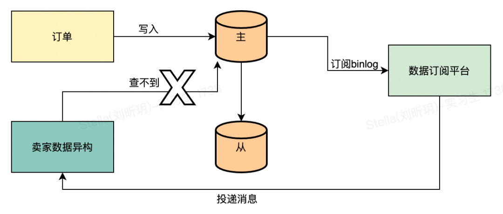
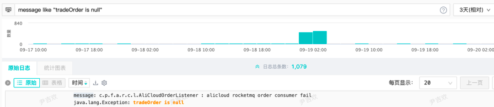
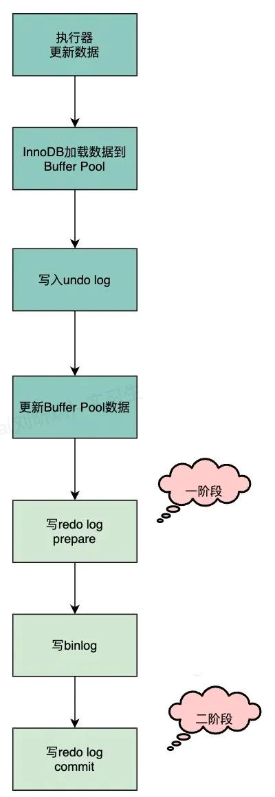
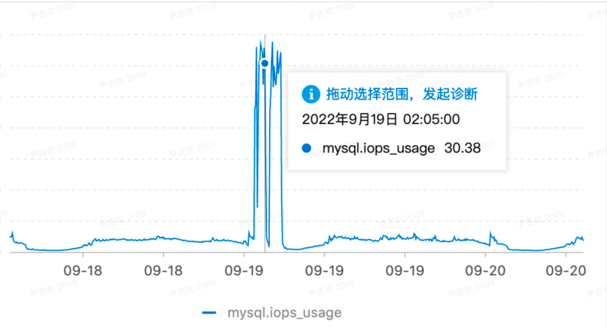
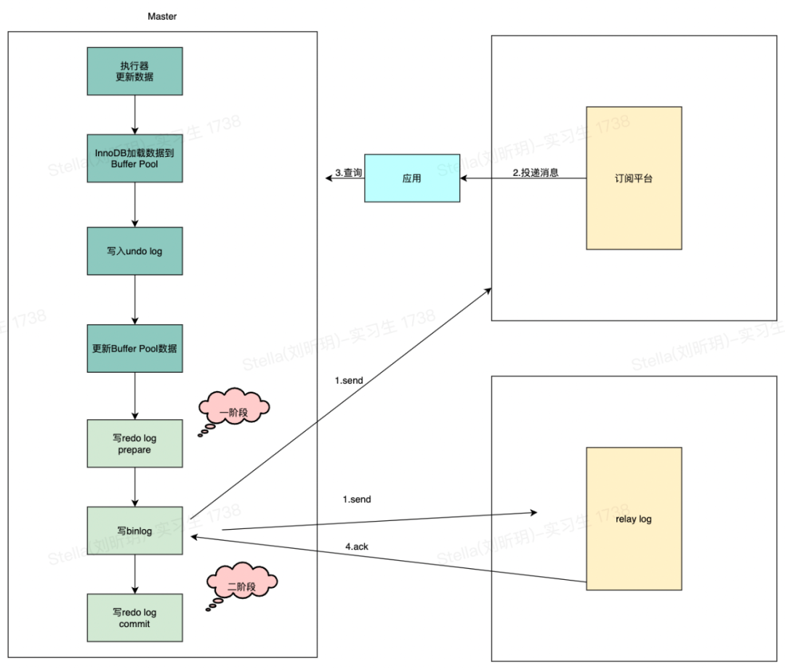

# 一、背景

> 电商业务场景，随着平台订单规模的日益增长，订单现有的存储已经没办法支撑后面业务的发展。

> 在得物五彩石项目的时候就对订单进行了分库分表的拆分，为了解决分库分表后卖家维度的查询问题，单独创建了一个卖家维度的订单库。

> 目前订单分为买家和卖家两个库，卖家库的数据是通过监听买家库binlog异构出来的一个库。现在订单主要有两张表，分别是订单的主表和子表。

> 在异构的逻辑中，会对这两张表的binlog消息进行处理，异构成卖家订单表。在监听到插入的消息时，只会处理子表的插入消息，其余需要补充的主订单表数据直接查询主表。

查询订单主表的时候如果为空就会抛一个异常，依赖MQ的重试功能进行下一次重试，这是目前的逻辑。正常情况下订单主表是不可能会出现查不到的情况，在19号凌晨的时候，有一大批订单主表查不到的告警，于是通过关键字去日志平台搜索，如下图所示：

# 二、分析

## **2.1 业务影响**

通过对报错的消息进行排查，消息在二次重新投递的时候，数据成功的保存到了数据库里面，**对业务无影响**，只是会有异常告警。

## **2.2 主从延迟**

目前的现象是第一次处理的时候，查询主表为空，异常重试后就能查询到数据。给我们的直觉就是数据库的主从延迟产生的问题。

根据这个想法，去排查对应的代码，发现从代码层面是走的主库查询。这里顺带介绍下主从路由是如何实现的，项目中依赖了数据库代理中间件彩虹桥的jar包，
支持通过配置（bifrost.read-write-separate-model=SQL_READ_DEFAULT_MASTER）指定默认的读写分离模式。我们的模式默认是路由到主库，如果有需要走从库查询的场景会在对应的dao方法上加一个注解进行标记。

然后会通过Mybatis的拦截器，对SQL进行处理，通过hint的方式将路由方式带给彩虹桥，彩虹桥内部根据指定的方式进行路由。

## **2.3 创单数据一致性**

主从延迟的排除后，怀疑点在另一个方面。会不会创单的时候数据保存没有在同一个事务里面，比如说子单先保存，然后再保存主单，此时子单的binlog肯定会早于主单，也就会存在查询主单为空的情况。

这个也很快被否决了，如果是这个情况，那肯定是100%必现的场景，不是存在偶现的情况。其次，创单的代码中对于数据存储那块是在一个事务内，所以不存在分批保存的情况。

## **2.4 数据库内部问题**

排除了外部相关的问题，那么只剩下数据库内部的问题。接下来从binlog的写入流程来看下是否存在有问题的地方，首先我们看下整体的流程，如下图：

这里比较怀疑的点就在于redo log 二阶段提交时，这个时候会把redo日志刷数据盘，也就是MySQL的存储数据真正落库。正常情况下，这个速度很快，当数据库的IO很高的时候，刷盘的性能也会有所影响。所以在刷盘时稍微延迟了X毫秒的话，binlog已经被应用给消费了，然后查询不到。

根据告警的时间点，去看了从节点数据库的监控，那段时间确实IO较高，如下图所示：

上面只是猜测，我们**如何去验证这个猜测是对的呢？**

目前用的数据库是主从模式，那么必然涉及到数据的复制，先简单介绍下复制的几种模式：

- **强同步**

- - 应用发起数据插入/更新/删除操作在主实例执行完成后，会将日志同步传输到所有备实例，至少1个备实例收到并存储日志后，事务才完成提交。

- **半同步**

- - 应用发起数据插入/更新/删除操作在主实例执行完成后，会将日志同步传输到1个备实例，备实例收到日志，事务就算完成了提交，不需要等待备实例执行日志内容。

- **异步**

- - 应用发起数据插入/更新/删除请求，主实例完成操作后会立即响应应用，同时主实例向备实例异步复制数据。

目前我们数据库用的是半同步的方式，在半同步里面支持两种模式，分别是AFTER_COMMIT（5.6版本默认）和AFTER_SYNC（5.7版本才有，默认）。

**1）AFTER_COMMIT**

master将每个事务写入binlog，传递到slave刷新到磁盘，同时master提交事务。master等待slave反馈收到relay log，只有收到ACK后master才将commit OK结果反馈给客户端。

AFTER_COMMIT意味在master上，刚刚提交的事务对数据库的修改，对其他事务是可见的。因此，如果在等待Slave ACK的时候crash

master将每个事务写入binlog , 传递到slave刷新到磁盘。master等待slave反馈接收到relay log的ACK之后，再提交事务并且返回commit OK结果给客户端。即使master crash，所有在master上已经提交的事务都能保证已经同步到slave的relay log中。

AFTER_SYNC在写完binlog后，就开始传输，但此时还没有提交事务，意味着当前这个事务对数据库的修改，其他事务也是不可见的。所以不会出现幻读，数据丢失风险。

我们目前是用的AFTER_SYNC模式，也就是说binlog写入后，master会等待slave的反馈结果，然后才会commit，这里也就能正常解释我们这个查询不到的问题是什么原因了。**原因就是master写完binlog后在等待中，slave收到binlog后，由于IO高，写入relay log比较慢，此时我们的订阅平台也相当于是一个从节点，同样也收到了binlog，然后投递给应用，应用这个时候去数据库查询，因为master还没commit，自然就查不到。**

# **三、解决方案**

**
**

针对这个问题，解决方案有很多，梳理后发现这个场景其实不影响业务，将告警信息调整下，并不需要改造业务，如果想改也有一些可以解决的方案。

## **3.1 重试机制**

对于这类场景，可以利用重试机制来解决。而目前的binlog监听也是利用MQ来投递消息给业务方使用，可以直接依赖MQ的重试即可。

这个业务场景本身就是一个异步的过程，对实时性要求没有那么高，其次对业务也不会有影响。第一次消息过来的时候没有查到，终止流程，然后等到MQ重试，就可以查到数据，完成整个流程。

## **3.2 延时消息**

可以对订阅平台进行改造，在配置订阅任务的时候可以指定监听到binlog后延迟多久发送给业务应用，这个延迟的处理直接用MQ的延时消息，这样就可以将消息晚几秒送到业务应用，也能解决问题。

延时消息也不能保证一定解决，重点在于延时的时间怎么设置比较合理。因为我们也不能保证数据库从节点收到binlog后ack的时间有多长。还有就是如果配置的很长，要对现有场景的业务进行评估，是否能够接受数据的延迟。

## **3.3 不依赖binlog**

不依赖binlog指的是将消息改成业务动作触发后发出的消息，比如创建订单后，在代码中通过MQ发出一条订单创建的消息，里面包含了订单的数据。这样业务应用就可以不直接依赖binlog的消息，监听到业务消息的时候，事务必定已经提交了，业务应用进行反查的时候数据已经有了。

# **四、总结**

数据库可以说是作为研发同学必须要掌握的一个技能，但在日常工作中我们只需要掌握一些基本的语法就可以满足开发需求，于是会忽略很多底层的原理。通过本文这个案例你会发现整个数据库体系还有很多内容值得去学习，试想一下，如果平时对主从复制的原理比较熟的话，问题排查起来也会简单很多。
