流量控制如何实现:

​	    如果生产者发出数据的速度和消费者处理数据的速度有所不同，这时候消费者应该采用特定的策略来消费数据流中的数据。如果消费者处理速度跟不上生产者的速度。

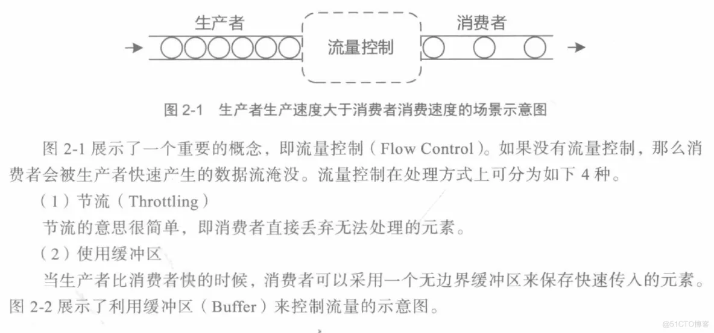

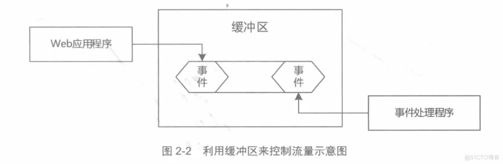

缓冲区的作用相当于把生产者发出的数据暂时存储起来供消费者慢慢消费。

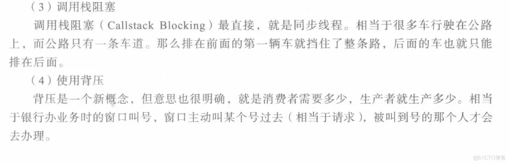

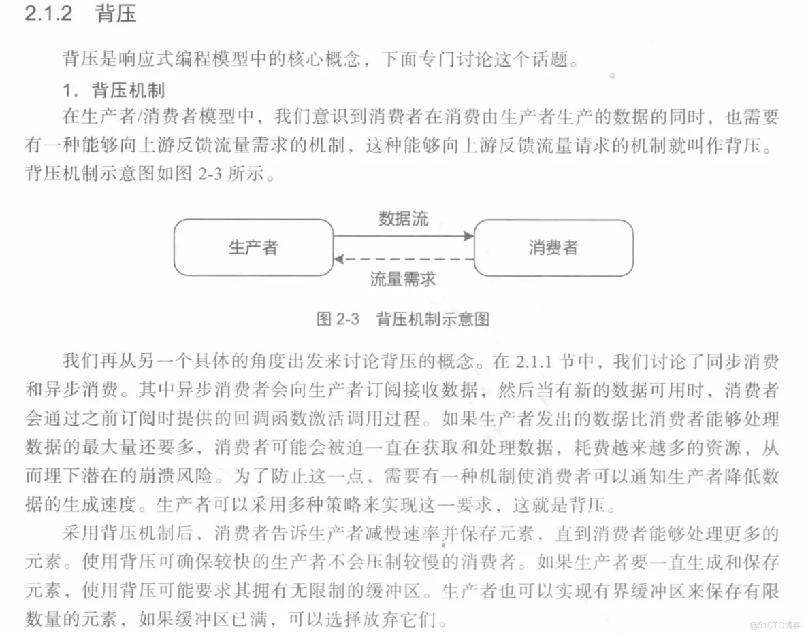

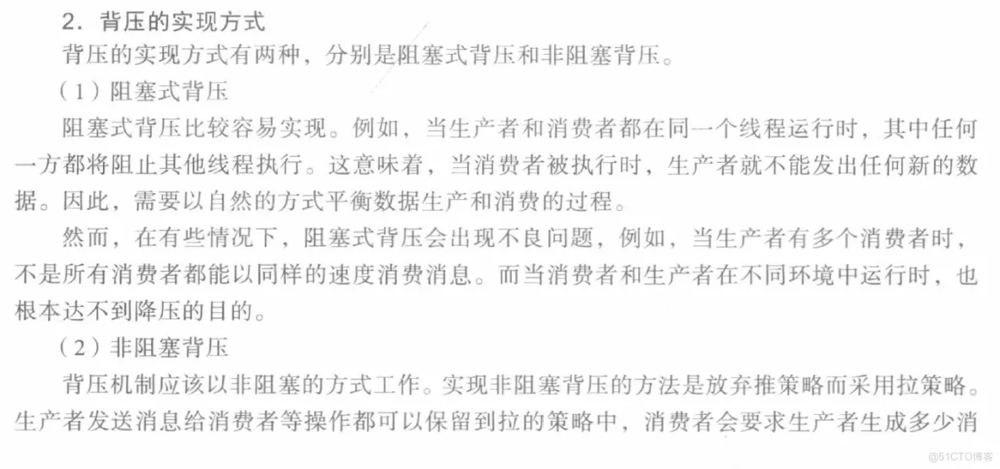

息量，而且最多只能发送这些量，然后一直等到堆更多消息的进一步请求。

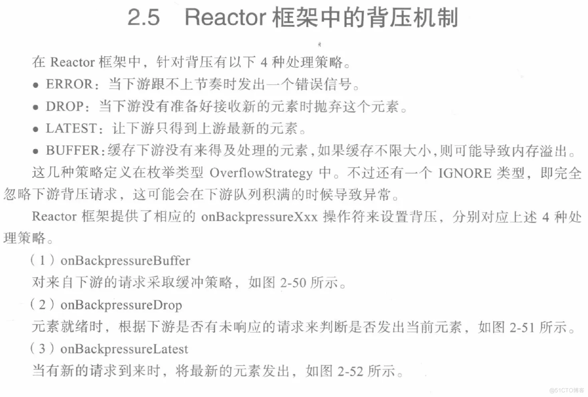

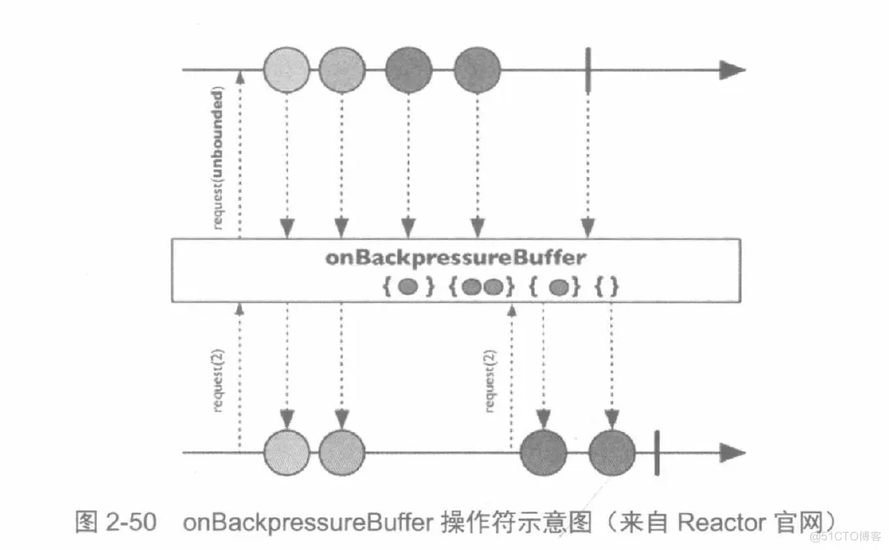

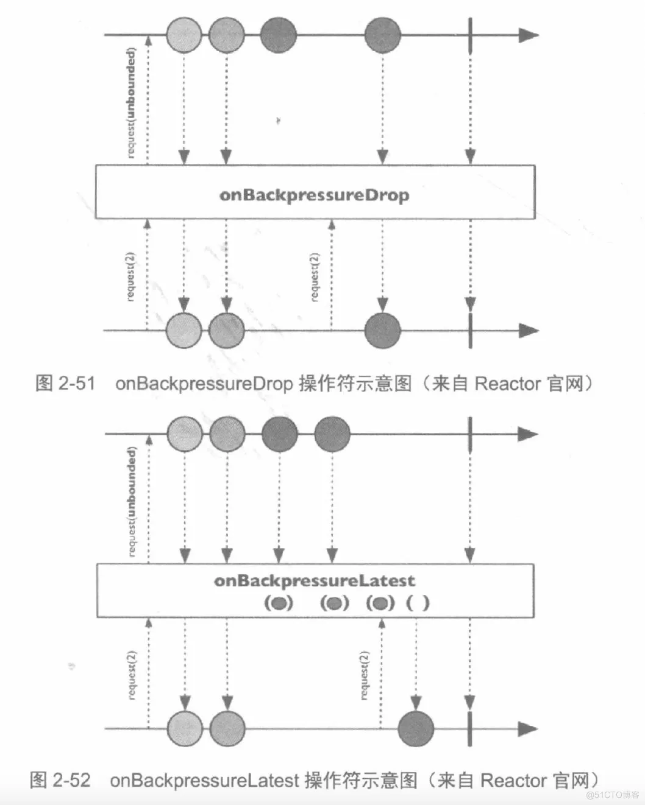

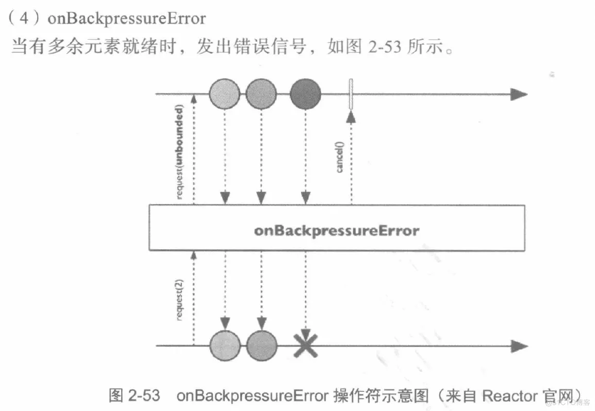

背压代码案例

先声明一个MyEventListener接口

```
package com.autonavi.aos.tmp.reactor;

public interface MyEventListener {
    void onNewEvent(MyEventSource.MyEvent event);

    void onEventStopped();
}
```

然后实现一个MyEventSource类，负责注册，新建事件event，事件停止eventStopped

```
package com.autonavi.aos.tmp.reactor;

import lombok.AllArgsConstructor;
import lombok.Data;
import lombok.NoArgsConstructor;

import java.util.ArrayList;
import java.util.Date;
import java.util.List;

public class MyEventSource {

    private List<MyEventListener> listeners;

    public MyEventSource() {
        this.listeners = new ArrayList<>();
    }
    public void register(MyEventListener listener) {
        listeners.add(listener);
    }
    public void newEvent(MyEvent event) {
        for (MyEventListener listener :
                listeners) {
            listener.onNewEvent(event);
        }
    }
    public void eventStopped() {
        for (MyEventListener listener :
                listeners) {
            listener.onEventStopped();
        }
    }
    @Data
    @NoArgsConstructor
    @AllArgsConstructor
    public static class MyEvent {
        private Date timeStemp;
        private String message;
    }
}
```

然后单测，测试不同的背压策略 buffer/drop/lastest/error，代码如下

```
package com.autonavi.aos.tmp.reactor;

import lombok.extern.slf4j.Slf4j;
import org.junit.After;
import org.junit.Before;
import org.junit.Test;
import org.reactivestreams.Subscription;
import reactor.core.Reactor;
import reactor.core.publisher.BaseSubscriber;
import reactor.core.publisher.Flux;
import reactor.core.publisher.FluxSink;
import reactor.core.publisher.Mono;
import reactor.core.scheduler.Schedulers;


import javax.annotation.Resource;
import java.time.Duration;
import java.util.Date;
import java.util.concurrent.CountDownLatch;
import java.util.concurrent.TimeUnit;

/**
 * @author guochuanzhi
 * @date 2022/02/19
 **/

@Slf4j
public class ReactorBackPressureTest  {


    private final int EVENT_DURATION = 10;    // 生成的事件间隔时间，单位毫秒
    private final int EVENT_COUNT = 5;    // 生成的事件个数
    private final int PROCESS_DURATION = 30;    // 订阅者处理每个元素的时间，单位毫秒

    private Flux<MyEventSource.MyEvent> fastPublisher;
    private SlowSubscriber slowSubscriber;
    private MyEventSource eventSource;
    private CountDownLatch countDownLatch;

    /**
     * 准备工作。
     */
    @Before
    public void setup() {
        countDownLatch = new CountDownLatch(1);
        slowSubscriber = new SlowSubscriber();
        eventSource = new MyEventSource();
    }

    /**
     * 触发订阅，使用CountDownLatch等待订阅者处理完成。
     */
    @After
    public void subscribe() throws InterruptedException {
        fastPublisher.subscribe(slowSubscriber);
        generateEvent(EVENT_COUNT, EVENT_DURATION);
        countDownLatch.await(1, TimeUnit.MINUTES);
    }


    /**
     * 测试create方法的不同OverflowStrategy的效果。
     */
    @Test
    public void testCreateBackPressureStratety() {
        fastPublisher =
                createFlux(FluxSink.OverflowStrategy.IGNORE)    // BUFFER/DROP/LATEST/ERROR/IGNORE
                        .doOnRequest(n -> System.out.println("         ===  request: " + n + " ==="))
                        .publishOn(Schedulers.newSingle("newSingle"), 2);
    }

    /**
     * 测试不同的onBackpressureXxx方法的效果。
     */
    @Test
    public void testOnBackPressureXxx() {
        fastPublisher = createFlux(FluxSink.OverflowStrategy.BUFFER)
//                .onBackpressureDrop()
                .onBackpressureBuffer()
//                .onBackpressureLatest()
//                .onBackpressureError()
                .doOnRequest(n -> System.out.println("         ===  request: " + n + " ==="))
                .publishOn(Schedulers.newSingle("newSingle"), 1);
    }

    /**
     * 使用create方法生成“快的发布者”。
     *
     * @param strategy 回压策略
     * @return Flux
     */
    private Flux<MyEventSource.MyEvent> createFlux(FluxSink.OverflowStrategy strategy) {
        return Flux.create(sink -> eventSource.register(new MyEventListener() {
            @Override
            public void onNewEvent(MyEventSource.MyEvent event) {
                System.out.println("publish >>> " + event.getMessage());
                sink.next(event);
            }

            @Override
            public void onEventStopped() {
                sink.complete();
            }
        }), strategy);
    }

    /**
     * 生成MyEvent。
     *
     * @param count  生成MyEvent的个数。
     * @param millis 每个MyEvent之间的时间间隔。
     */
    private void generateEvent(int count, int millis) {
        for (int i = 0; i < count; i++) {
            try {
                TimeUnit.MILLISECONDS.sleep(millis);
            } catch (InterruptedException e) {
            }
            eventSource.newEvent(new MyEventSource.MyEvent(new Date(), "Event-" + i));
        }
        eventSource.eventStopped();
    }

    /**
     * 内部类，“慢的订阅者”。
     */
    class SlowSubscriber extends BaseSubscriber<MyEventSource.MyEvent> {

        @Override
        protected void hookOnSubscribe(Subscription subscription) {
            request(1);
        }

        @Override
        protected void hookOnNext(MyEventSource.MyEvent event) {
            System.out.println("                      receive <<< " + event.getMessage());
            try {
                TimeUnit.MILLISECONDS.sleep(PROCESS_DURATION);
            } catch (InterruptedException e) {
            }
            request(1);
        }

        @Override
        protected void hookOnError(Throwable throwable) {
            System.err.println("                      receive <<< " + throwable);
        }

        @Override
        protected void hookOnComplete() {
            countDownLatch.countDown();
        }
    }
}
```

buffer策略的执行效果

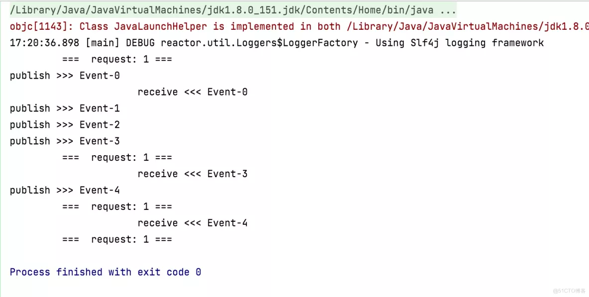

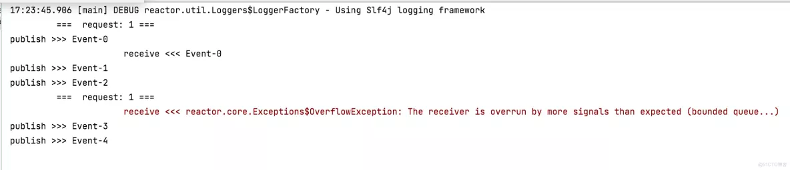

