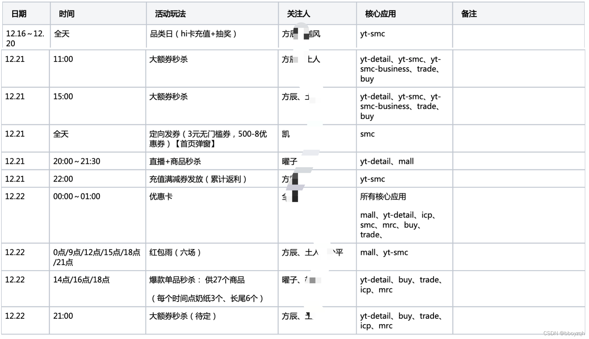

# 电商大促作战指南

## 背景

一般电商公司会定期举办大型促销活动（简称大促）来提高公司GMV和公司的影响力，比如天猫双11、京东618等。大促流量一般比平时流量大，且在固定时间点相对比较集中，这就考验着电商公司的基建能力，也对研发人员有着更高的要求。
笔者在2021~2022年期间有幸参与了大促，大促作战整体流程的“套路”往往殊途同归，文中观点有误请随时指正！

整体大促作战流程可分为战前、战中和战后三个阶段，如下图所示：

## 战前

大促战前的工作会直接决定整个大促的成败，战前的主要工作包括**大促运营计划、全链路压测、紧急预案梳理与验证、前置预案执行、大促活动数据配置校验和大促作战手册
**。战前工作的每一部分都是必不可少的一部分，其中**全链路压测**是大促稳定性保障的基石。

### 大促运营计划

一切大促都从大促运营计划开始，往往在大促前一个月起运营计划已经初步形成（这里不再讲述运营的准备工作，以技术为侧重点），首先进行的是大促运营计划宣讲，核心参与人主要有
**业务PM及各业务核心运营、核心技术负责人、核心业务PD**等。主容主要明确以下几点：

* 大促时间节奏，包括预热蓄水期和正式爆发期
* 大促优惠策略和优惠力度，如秒杀券满50减30等
* 目标GMV

这里重点强调两个词：**优惠策略**和**优惠力度**。
**优惠策略**是指运营结合多种营销玩法常用的营销手段，运营平台经常会提供多种多样的营销玩法如累计返利、满减等，但每种营销玩法有其特定的场景和局限性，为了达到更好的营销效果，运营经常会结合多种营销玩法去设置活动。
举个例子，购买商品A返满10减5优惠券（礼包套餐活动），同时商品A参与了累计返利活动，意味着商品A同时参与了礼包套餐活动和累计返利活动，可能在同一大促时间点分布在两个不同的会场，
这就需要**技术PM进行大促计划时需要关注到具体的优惠策略，在做大促方案时需要关注到具体的商品ID**。
另外优惠力度是指优惠的程度大小，做事程度大的活动自然会吸引很多流量，针对的大促的方案也会特殊对待，比如大额秒杀券和普通秒杀券优惠力度就不一样。

运营计划宣讲以后，接下来由各域负责人需要选出大促技术PM、PTM、以及各子域PM，最终整个大促运营计划由技术PM和PTM来规划和主导。技术PM和PTM需要确认以下几项：

* 大促运营计划中是否有遗漏问题，若有问题，是否有替代方案
* 全链路压测支持人员及大体时间节奏，后续需要制定全链路压测计划
* 大促值班人员及时间点

### 全链路压测

篇幅有限，且全链路压测是一项复杂耗人力的工作，需要单独一篇，

请看这里[电商大促作战指南之全链路压测](https://blog.csdn.net/zhuqiuhui/article/details/122799790)

参考这里[关于性能测试的几个要点](https://www.jianshu.com/p/e7629acde434)

### 紧急预案梳理与验证

紧急预案包括技术紧急预案和业务紧急预案，技术紧急预案是针对系统异常如限流降级等应急方式，业务紧急预案用于应对业务变更等非系统性异常带来的需应紧急处理的问题，有时候技术紧急预案可以和业务紧急预案相互补充来应对异常场景。另外，对紧急预案的验证是一个很重要的工作。

### 前置预案执行

前置预案执行主要是指为迎接大促做的准备工作，如机器重启、缓存清理与预热、表数据清理、限流等。

### 大促活动数据配置校验

大促活动数据配置校验是一项非必要但重要的工作，“非必要”是指在运营配置完活动数据后，是否有必要由开发再次check一遍，这涉及到运营活动数据一旦配置错误后故障担责问题。大促活动数据配置流程最好增加如审核加多重业务提示的方式尽量减少风险。不同的业务数据检测不一，笔者负责营销域开发，一般涉及到活动基本数据的校验（如活动时间、优惠券发放数量及额度）。

### 大促作战手册

大促作战手册是整个大促保障的行动依据，大促作战手册是常见稳定性问题解决方案手册，手册的积累与完善必须是一项常态化的工作，这样才能做到尽量的全面，笔者曾经想尝试收集公司内所有大促稳定性问题和日常故障并整理为“稳定性问题常见解决方案”手册，耐何级别和广度不够，只能总结自身域的稳定性问题。技术总结是伴随着每位研发的职业生涯，笔者建议每位研发养成技术总结的习惯。示例如下：

* 内存暴涨常见解决方式及故障事例
* 接口超时学习排查方式
* ......

## 战中

### 大促重点保障时间点

大促需要依赖大促运营计划制定大促重点保障时间点及相关的业务，需要明确到具体的活动玩法、值班人及涉及的核心应用，另外，大促前一周需禁止核心应用的线上变更（紧急变更走审批）。示例如下：

### 大促值班人员及其写作

除上述重点保障时间点值班人员外，还需要其他如运维、前端、测试、业务、技术、数据等人员时刻 ready 来应对紧急状况。值班内容包括：

* 重点保障时间点关注系统告警、监控指标
* 大促性能及业务问题解决并记录（比如工单、截图、日志等）
* 核心业务指标、性能指标等播报
* ......

## 战后

大促过后需要做好复盘工作，其中包括：

* 系统资源回收，包括限流阈值调整、集群缩容等操作
* 业务问题、稳定性问题复盘出现的原因、解决方案，并对应到具体解决时间点和责任人
* 做的好的地方和不足的地方（如遗漏点等）
* ......

## 小结

上述大促作战的每个环节的细节和示例点会有不全，但总体大促作战思路是一致的。另外，大促作战的稳定性比较依赖于日常系统的健康程度，日常稳定性工作做得不够好，很容易在大促中暴露稳定性问题，作为研发要多在日常工作中多参与、多观察与多解决相关的稳定性问题，这样才能在大促中做到有条不紊。

## 参考

参考：

* [效告警优化实践总结](https://mp.weixin.qq.com/s/cBCaHwEvQFGM7RNDMMavzA)
* [稳定性保障6步走：高可用系统大促作战指南](https://mp.weixin.qq.com/s/w2tOXR6rcTmUHGsJKJilzg)
* [关于性能测试的几个要点](https://www.jianshu.com/p/e7629acde434)
* [如何做“健康码”的性能压测？](https://mp.weixin.qq.com/s/ywI6X7rPKOz_kCF2IMqeaw)

横向关联内容：

请看这里[电商大促作战指南之全链路压测](https://blog.csdn.net/zhuqiuhui/article/details/122799790)

参考这里[关于性能测试的几个要点](https://www.jianshu.com/p/e7629acde434)