# 电商大促作战指南之全链路压测

> 电商大促作战指南请看上一篇：
> [电商大促作战指南](https://github.com/Leon59/blogs/blob/main/blogs/solutions/%E5%A4%A7%E4%BF%83/%E7%94%B5%E5%95%86%E5%A4%A7%E4%BF%83%E4%BD%9C%E6%88%98%E6%8C%87%E5%8D%97.md)
> ，因篇幅有限，这里单独对全链路压测进行详述。
>
> as also [电商大促指南](../../../blogs/solutions/大促/电商大促作战指南.md)

全链路压测是一项既耗时又耗人力的工作，所以必须要做好详细且周密的计划，全链路压测涉及的重要节点如下图所示：

## 1. 压测人员确定

压测人员需要做到广而精，“广”是指人员要覆盖到核心链路应用负责人、运维、DBA、重要中间件负责人。“精”是指压测人员需要熟知负责应用的上下游，同时能在压测期间出现性能问题时能快速解决问题。

压测人员示例

|   应用   |  负责人   |
|:------:|:------:|
|   导购   |  xxx   |
|   交易   |  Leon  |
|   营销   |  xxx   |
| ...... | ...... |

## 2. 核心链路业务梳理

核心链路业务梳理内容主要包括两项：**应用强弱依赖梳理（限流降级等）、高风险业务梳理**
（比如上次大促后，存在大版本升级的业务应用或者未经历过大促的业务）。
这里最好产出一张应用大盘图，标注出核心链路，示例如下：

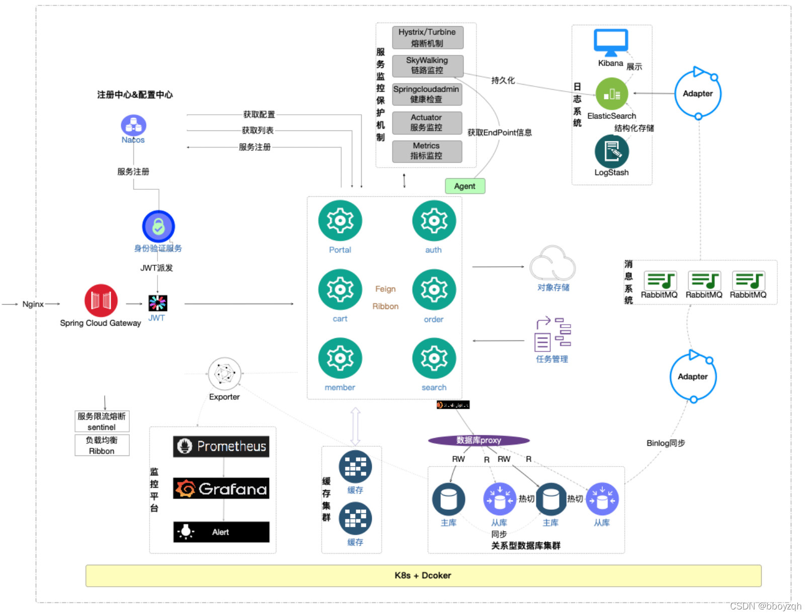
> 图参考：[极客时间](https://so.csdn.net/so/search?q=%E6%9E%81%E5%AE%A2%E6%97%B6%E9%97%B4&spm=1001.2101.3001.7020)
> 《全链路压测30讲》

在梳理出核心链路后，需要应用owner再梳理出核心接口，主要用于三个场景：性能指标监控、限流等稳定性措施配置、压测。示例如下：

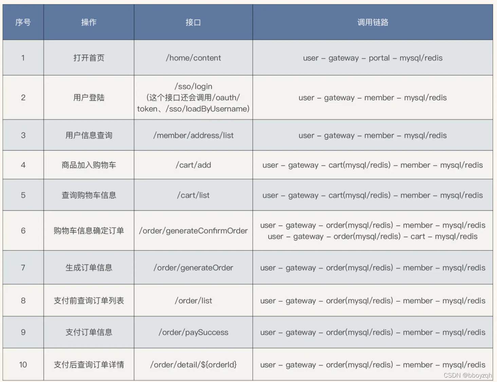
> 图参考：[极客时间](https://so.csdn.net/so/search?q=%E6%9E%81%E5%AE%A2%E6%97%B6%E9%97%B4&spm=1001.2101.3001.7020)
> 《全链路压测30讲》

另外高风险业务梳理完成后需要给出明确的稳定性方案，比如可降级，需要给出降级方案，不可降级需要给出可替代或者紧急预案。尽量在大促前把所有可能都设想一遍。

## 3. 流量预估与压测模型产出

流量预估比较考验应用负责人的功底，应用负责人要熟悉负责应用的上下游依赖和重要核心接口的性能指标，只有这样才能合理地进行流量预估。这个阶段应用负责人需要做几下几项工作：

* 梳理出关键路径的核心接口，包括其上下游依赖应用及性能指标
* 根据历史大促水位和接口性能指标预估出接口容量，比如接口的qps值
* 输出应用压测模型

### 3.1 入口流量预估

系统流量入口是指调用链路的起始端，比如首页、商品详情页和列表页等场景的调用始端是指mall、detail等应用，预估的方式通常是参考历史GMV或者订单数量或者DAU（笔者所在公司可是使用同时在线的门店数量），在参考的同时也要考虑一些不变的因素，如营销活动、活动商品的相似性等。以20210518大促流量预估示例，在进行预估时参考了20201215的大促流量，同时营销活动场景也类似，所以具有很强的参考意义。
附流量预估参考GMV通用公式如下：

***预估大促qps值=（预估大促GMV/历史大促GMV）`*`历史大促qps值***

另外，在预估时要考虑以下不变的因素（因素较多，需要参考具体的业务场景）：

* ***营销活动差异***
  ：参考历史大促进行预估时需要注意到，相同GMV不同的营销活动场景，相应的大促qps峰值是不同的，所以在进行预估时需要考虑营销活动的差异性。比如1215和518大促活动玩法、GMV相似，那在整点的qps峰值也是相似的，是很有参考价值的。
* ***活动商品的差异***
  ：活动商品的差异会影响成交的订单量，间接影响成交的GMV，最终也会影响到流量预估的准确性。如327大促和518大促GMV一样，但针对的商品类型不一样，327大促针对的是A类商品，518针对的是B类商品，B类大促的客单价是高于A类大促的，所以理论上327大促的订单量会大于518大促的订单量，即327大促的qps值理论上会高于518大促的qps值。
* ***活动时间的差异***：事实上518大促的qps值是低于各应用owner给出的qps值，是因为忽略到了季节的差异性，即“一年中的上半年是下单的淡季”。相对于年终来说流量相对较少（年终有春节和元旦重要的节假日）。
* ......

### 3.2 节点流量预估

作为流量入口链路上的节点同样在大促中给出流量预估值，如营销核心应用smc应用和mrc应用。节点流量由入口流量根据流量分支模型，按比例转化而来。分支流量模型以系统链路为计算基础，遵循以下几个原则：

* 同一入口，不同链路占比流量独立计算
* 针对同一链路上同一节点，若存在多次调用，需计算按倍数同比放大
* DB写流量重点关注

举例说明，mrc应用中 multiMatchForKeyDataId 接口是营销的核心接口，流量预估时首先切分上游的流量，如下图

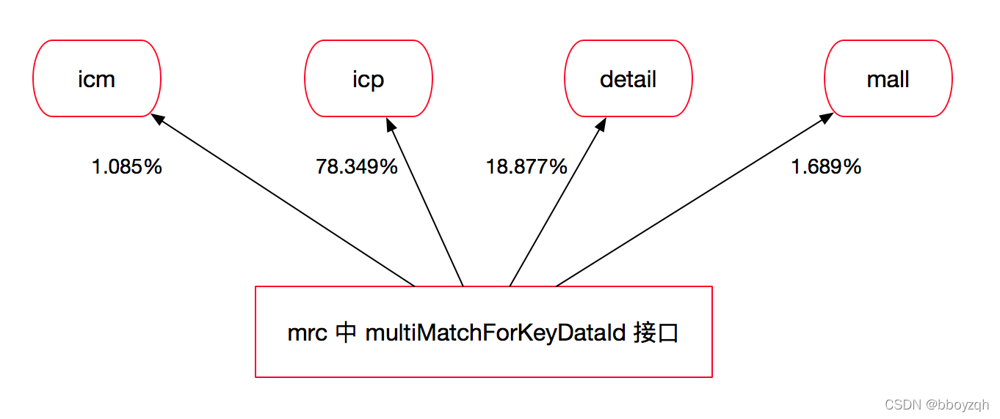

multiMatchForKeyDataId的上游流量除应用owner评估外，还需要同各上游确认预估值是否能满足上游调用（如icm的1.085\%的流量大本次大促预估中是否有流量发生变化，若有变化，变化系数多少，一般这个值是由上游应用owner来确认），见下表：

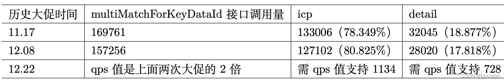

上表统合上面计算出mrc应用multiMatchForKeyDataId接口预估出2010，同时做好客户端和服务端限流即可，该预估方式得出的值与1222号大促值十分接近。在理想情况下应该有个接口调用地图，地图中每个应用的核心接口做为节点，节点连线表示调用关系，连线的值作为qps值。

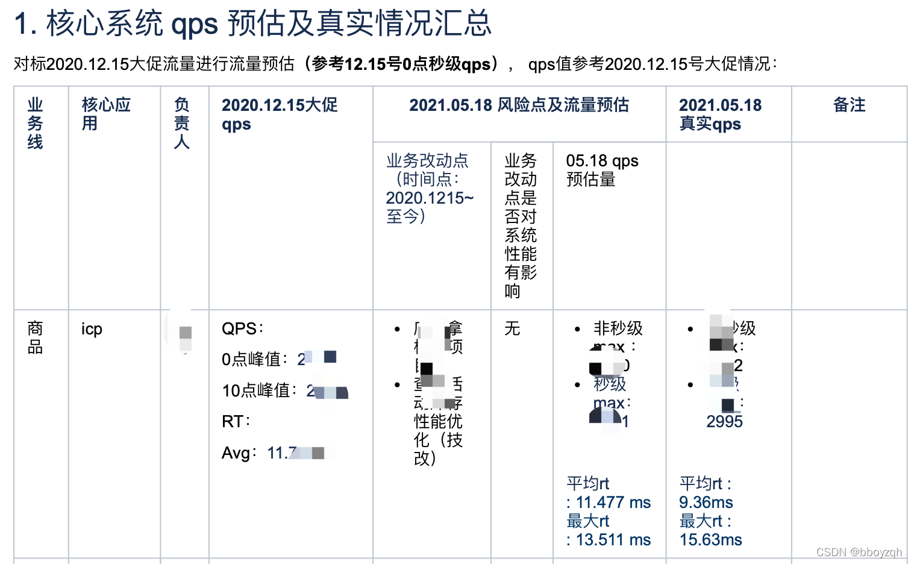

### 3.3 压测模型产出

在各应用做好流量预测后，便可以初步得出压测模型，如下图所示，该压测模型用于后期与压测得出模型、大促真实流量模型进行对比，用于验证流量预测的偏差，为后续大促支持积累宝贵的压测经验。

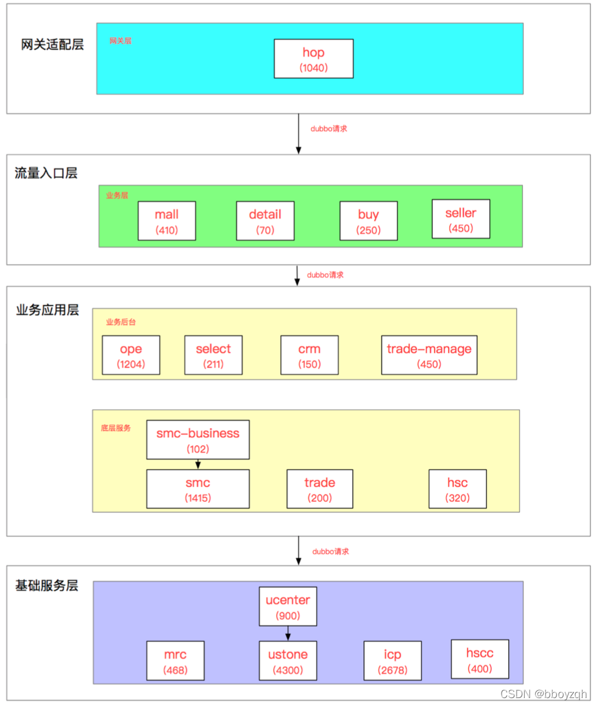

## 4. 压测数据准备与联调

压测数据准备包括影子库申请、流量录制和压测数据初始化（影子库）。其中压测数据初始化是指将流量录制时间点的数据快照初始化到影子库中。笔者所在公司压测平台采用的是流量平台进行流量录制（GoReplay），录制回放过程中使用压测标透传整个链路，透传到DB层使用影子库进行隔离，这里不详述全链路压测的技术方案。压测数据准备过程中需要注意以下几点：

* 流量录制的场景尽量选择与大促相似的场景
* 流量录制时间点的线上数据要保存快照初始化到影子库中，前后时间不能相差太大，否则会出现压测请求得不到正常响应
* 压测数据重点关注导购和营销数据的时效性，往往流量录制时间点和真正压测时间不在同一个时间段，经常会出现活动数据失效的场景

基于以上数据准备后，便可进行小比例流量进行调试，在不影响线上业务的前提下确保流量入口接口请求成功率100%、响应数据能正常写入影子库、确保所有的监控都已到位等。

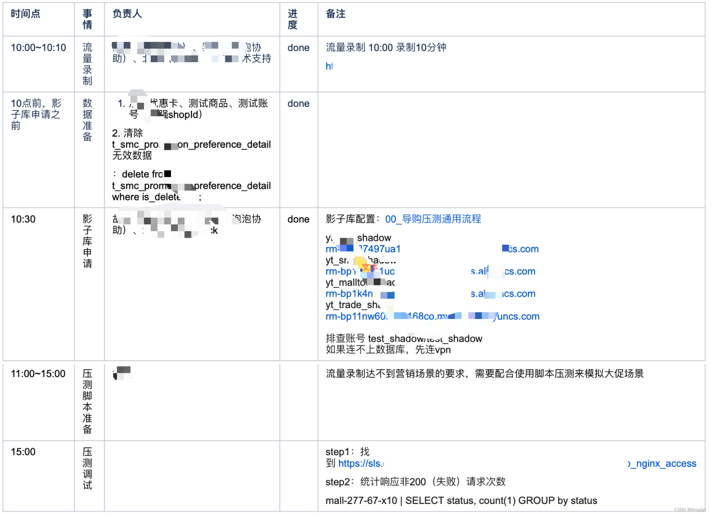

## 5. 压测执行

压测执行是压测过程中最关键的环节，压测的目的是指出系统的“最大”和“最佳”点，如下图所示（引用关于性能测试的几个要点）：

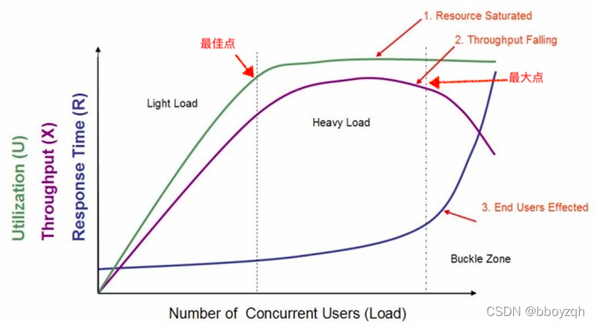

上图中在轻负载区域和重负载区域交界处称为"最佳点"。而重负载区域和负载失效区域交界处称为"最大点"。

* 当系统的负载等于“最佳点”时，系统的整体效率最高，系统资源利用率适中，用户请求能够得到快速响应
* 当系统负载处于"最佳点"和"最大点"之间时，系统可以继续工作，但是响应时间开始变长，系统资源利用率较高，并持续保持该状态，如果负载一直持续，将最终会导致少量的用户无法忍受而放弃
* 当系统负载大于“最大点”时，将会导致较多用户因无法忍受超长的等待而放弃使用系统，有时甚至会出现系统崩溃而无法响应用户请求的情况发生

所以压测过程中要考虑压测时长，比如180s、300s、600s系统指标是怎么样的，进而找到系统的“最佳”和“最大”性能点。因为有个很形象的说法就
是：你能够承担100千克的重量，而且也能走，但是你能否承担100千克的重量行走1个月。笔者曾经做单接口压测时就走入了一个误区，只要发现某个场景某个轮次达到系统“个人理解”意义的最高点，便停止压测了，事实上这个最高点是位于“最佳”点，还是位于“最大点”却不得而知，即无法得出系统（或者接口）的真正水位。

> 参考这里[关于性能测试的几个要点](https://www.jianshu.com/p/e7629acde434)

### 5.1 前置工作

缓存预热、接口限流值关闭等。另外压测执行前还需要确定施压流量的地域分布，应尽量拟合真实的用户分布，才能保证测试结果真实可信。对于区域性的在线业务，施压机分布在当地的同一机房，是可以理解的。如果是全国性的在线业务，施压机也应该按照用户分布，在全国各地域部署。

### 5.2 分场景不同时长压测

压测场景需要按大促业务场景来定制，比如本次大促有秒杀券，则构造基础数据与流量录入环节需要考虑相应的场景，确定好压测场景好再按系统容量可分为基线、容量摸高、稳定性和异常场景，最后分不同时长压测来观察系统稳健度，所以压测执行前需要规划好压测场景、压测轮次和每轮压测持续的时长，这是一项比较复杂的工作。

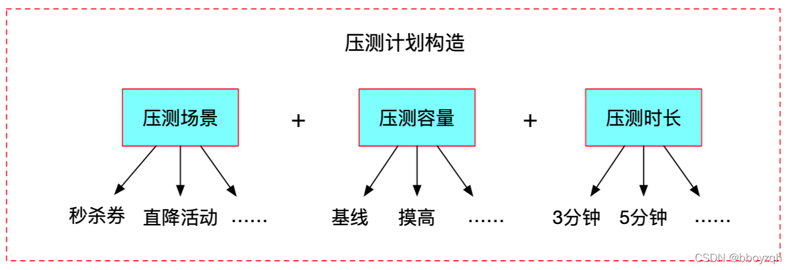

### 5.3 监控指标

在压测过程中需要时刻观察系统指标，包括但不限于：

* 服务器指标：机器cpu、内存、网络流入流出、jvm指标等
* 数据库指标：慢sql数量、qps、索引命中率、锁等待时长等
* 业务指标：下单趋势、下单成功率等
* 系统指标：核心接口qps、平均rt、失败率等
* ......

一旦指标出现异常则停止压测，所以这里有必要梳理出压测启动、停止和结束准则（不再详述）。压测结束后，压测报告中重点观察三个核心指标（需要具体到秒级别的统计，往往系统高峰期会产生秒级曲线）：请求成功率、接口（系统）qps、接口（系统）平均rt。

### 5.4 压测记录

压测过程中还需要做好压测指标、压测问题和压测现场记录，因压测参与人多，压测时间比较宝贵，记录方式可以采用截图结合概要记录的方式来进行压测记录，只要做到重要信息不遗漏即可，方便压测结束后进行压测结果分析。

### 5.5 压测结束

压测执行结束后，一般全链路压测结果会有两种场景：

1. 低于大促性能要求，需要解决系统瓶颈，再次进行全链路压测，直到系统满足大促目标容量
2. 达到大促性能要求（一般达到大促预估容量1.5倍以上），则可尝试对系统进行进一步摸高，压出系统的瓶颈点

下图是笔者压测执行过程示例（仅供参考）：

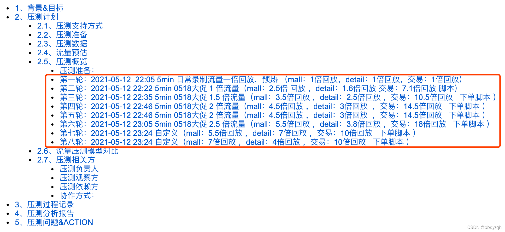

## 6. 压测恢复

压测恢复是指压测后进行的一系列有关压测资源回收和数据清理的操作，比如回收压测机器、应用缩容、回收影子库、清理压测数据等。为避免排查压测性能问题时监控信息丢失（比如影子库监控是随着影子库的回收而回收），资源的回收信息需要同步到压测技术群。笔者曾经为了排查压测产生的慢sql问题，因影子库回收而不得不自行进行一次压测来恢复现场。

## 7. 压测复盘

压测复盘是对压测过程进行分析总结，并根据以下点来决定是否要再进行一次全链路压测：

* 是否达到大促性能要求
* 是否出现影响大促的性能问题，如果出现性能问题，则需要分析具体性能问题并给出解决方案

如果压测结论符合预期，可以得出系统的性能指标，并据此来配置限流降级策略来保证系统稳定性。下图示例为笔者在一次全链路压测时遇到的性能问题总结示例提供参考：

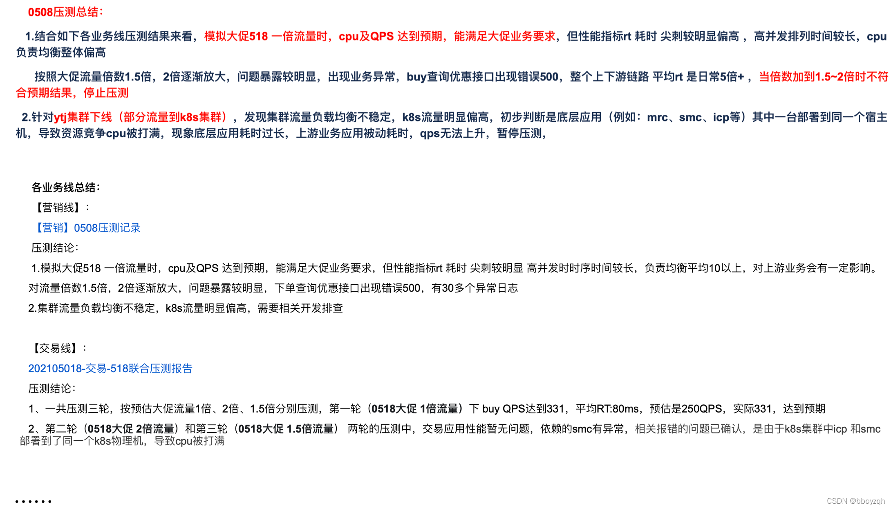

> 参考自[全链路压测](https://blog.csdn.net/zhuqiuhui/article/details/122799790)