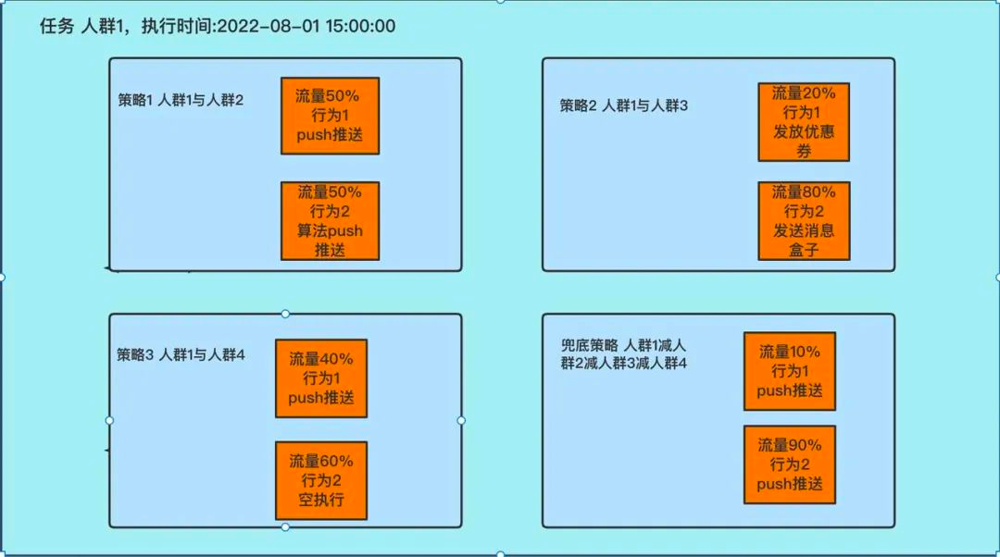
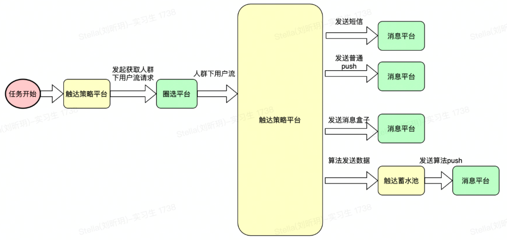
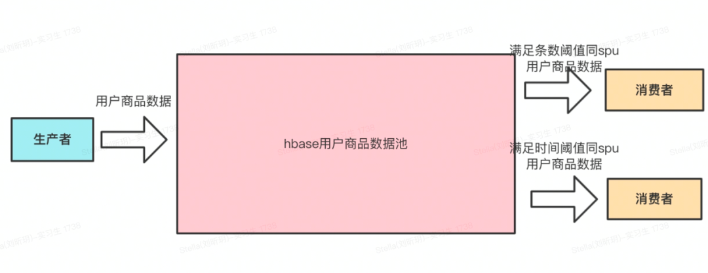
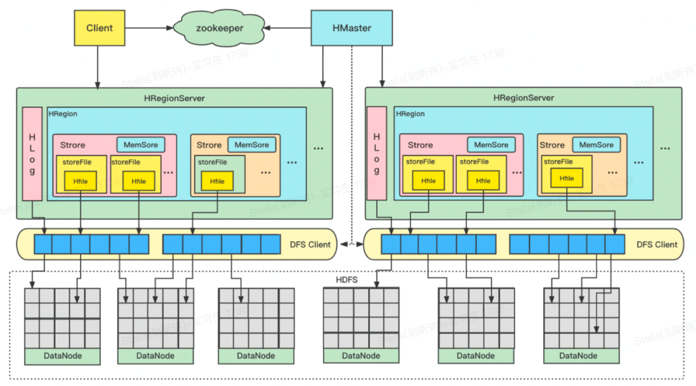
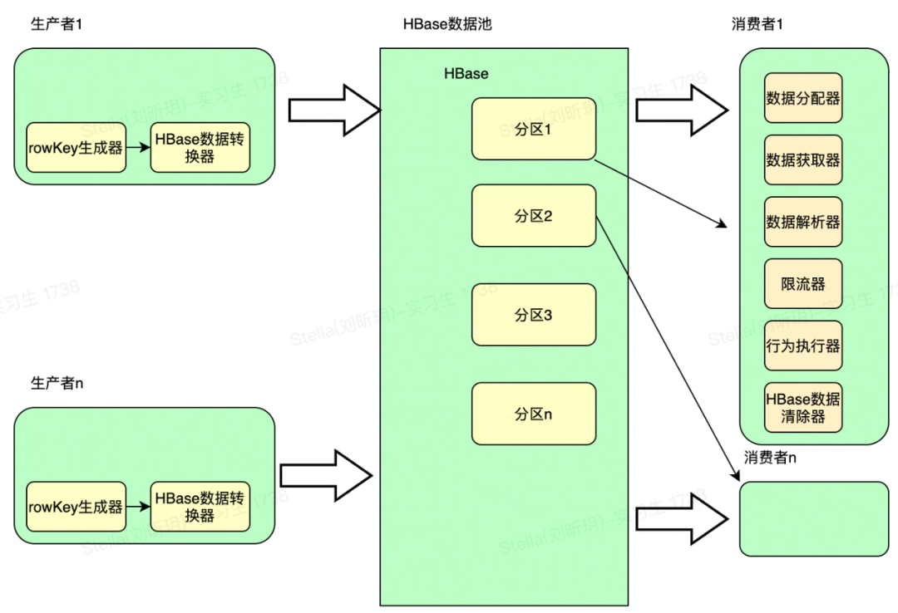

# 1. 简述

触达策略这几个字听起来比较抽象，刚开始听到并不能直接理解。简要描述下，触达策略的核心是任务。首先配置任务，任务下有策略，策略下有行为，行为可以发送push推送、发放优惠券、发送消息盒子、发送短信等。然后等到任务执行时间，执行任务下所有行为。

蓄水池是提升触达策略平台算法推送能力的实现，为算法亿级数据推送能力提供了技术支持。

# 2. 得物触达策略平台

得物触达策略平台是通过用户的诸多特征划出一批用户，然后到指定时间执行给用户发送push，短信，消息盒子等行为的系统。主要由任务、策略、行为、蓄水池、文案池等组成。接下来将通过“任务主体结构图”和“任务执行结构图”来介绍。

## 2.1 任务主体结构图

通过这张图可以简单的看到，任务下有策略，策略下有行为，通过策略下的行为来实际执行对应的push推送。

## 2.2 任务执行主体结构图

# 3. 算法个性化从百万到亿级，得物触达策略平台怎么做

触达策略平台提供了一个强有力的和得物用户沟通的渠道。触达策略平台通过AB实验、文案赛马、回流数据分析、推送发送时机等多种维度决策出了触达策略平台和用户沟通的最佳方案。为了追求更好的用户体验，触达策略平台全面引入算法。触达策略平台使用蓄水池能力支撑起了算法亿级数据处理的需求。通过我们的实践和触达策略任务执行模型以及蓄水池功能，已经完成了从算法个性化从百万级到亿级的演进。

# 4. 触达策略平台蓄水池

## 4.1 为何要做蓄水池

以上讲述了触达策略平台主体业务，行为中有算法推送行为的case。算法推送的push内容来源于算法，实时情况下每个人的推送数据并不一致，一段时间内部分人推送数据会相同的特点。

触达策略的蓄水池简单来说就是将要执行的用户数据暂存到池子里，待蓄水池中数据满足一定条件后，再把符合某一特征的用户数据捞出处理。

举个算法例子，在算法降价通知场景，1.0版本算法推送量还比较少，1.0版本圈选平台人群下用户流过来时我们是实时发送推送的，因为一批数据中大多数人push数据都不相同需单个调用。如果我们一直这么做，算法扩量后1小时推送1亿用户的1亿次调用,消息平台会扛不住，触达策略系统压力也增大不少。

1小时内调用消息平台1亿次是不OK的。为了解决上面的问题及考虑到我们业务特点，比如15分钟同一个商品的降价推送大概率会发给几十个用户。由此我们可以做个蓄水池，对于收到的用户先暂存，然后将它们按照所属降价商品id分组分批执行。用一句话概括就是用户降价商品数据超过一定量或用户降价商品数据超过指定时间，只要满足任何一个阈值就执行对应的行，蓄水池功能就提上了日程。

简言之，蓄水池做的就是将不可批处理的实时数据流暂存，再将暂存的所有数据按照某个特征分组，最终将分组好的数据批处理的一件事。

蓄水池业务结构图：

## 4.2 为何会选用HBase作为蓄水池的存储层

* 海量存储及持久化

HBase适合存储PB级别的海量数据，存储介质可使用廉价PC。其持久化满足我们对于数据不丢失的需求，能在几十到百毫秒内返回数据。HBase良好的横向扩展性，实现了海量数据的存储能力。单表可满足我们每日亿级数据处理和数据极限会存储数十亿行的需求。

* 存储使用列式存储

这里的列式存储其实说的是列族（ColumnFamily）存储，HBase是根据列族来存储数据的。列族下面可以动态扩展非常多的列，满足我们存储数据灵活格式和动态扩展的需求。

* 方便横向扩展

HBase的扩展性主要体现在两个层面，一个是上层（RegionServer）的横向扩展提高处理能力，一个是存储（HDFS）横向扩展提高大数据量存储能力。通过添加RegionSever机器，进行水平扩展，提高Hbsae服务RegionServer支持更多Region的能力。

备注：RegionServer的作用是管理Region、承接业务的访问，通过横向添加Datanode的机器，进行存储层扩容，提升HBase的数据存储能力和提升后端存储的读写能力。

* 高并发、高读写性能

由于目前大部分使用HBase的架构单个IO延迟是可接受的。并且在高并发环境下，HBase的单个IO延迟下降不严重。HBase天然方便构建高并发、低延迟的服务。当然其满足了我们同时小时内亿级读写数据需求。

* 稀疏

稀疏主要是针对HBase列的灵活性，在列族中，你可以指定任意多的列，在列数据为空的情况下，是不会占用存储空间的。

* rowKey前缀扫描

HBase支持rowKey前缀扫描分批拉取数据，预拉取数据缓存本地。主键scan功能可覆盖触达策略蓄水池业务查询需求。大数据量下数十万条数据每秒的拉取性能满足查询的性能要求。

## 4.3 HBase简单介绍

### 4.3.1 HBase 架构图

### 4.3.2 介绍下蓄水池功能中用到的HBase

HBase是天然的分布式数据库，Table可类比MySQL表中的Table，Region可类比MySQL分库分表中的一张分表，rowKey可类比MySQL表的主键id。单个Region区数据过多时，HBase会将Region分裂为多个Region，由HBase控制。建HBase表时可指定预分区，举个例子，依据rowKey大小可设置小于1的任意字符到1、1到2、2到3、3到4、4到5、5到大于5的任意字符这6个Region分区。预设分区的目的是使HBase存储的数据和流量可以均匀的分布到不同的Region上。

## 4.4 蓄水池技术结构介绍

### 算法降价商品举例：

* 生产者

获取到降价商品数据后生成 ***rowKey = hash(spuId+分隔符+templateCode)
+分隔符+spuId+分隔符+templateCode+分隔符+userId*** ，rowKey在HBase上是有序排序的，这样的rowKey可以将不同组数据离散到不同的HBase分区上，
同时又保证了同样的推送spuId的数据在一片连续的内存，通过顺序读的方式提升数据读取性能一个数量级。rowKey设计前缀
***hash(spuId+分隔符+templateCode)***
，这么做的其目的可以将数据打散分布到所有Region上，解决了spuId数据前缀相同导致的热点数据问题，同时经过hash后所有rowKey数据分布的更离散。HBase数据转换器可以将HBase需存储的数据尽量压缩减少空间占用保证HBase的高性能。

* HBase数据池

HBase数据池的职责存储数据，并根据rowKey值分布和范围均等分割到不同的预分区上，然后将分区均等的分布到不同的RegionServer上，并按照rowKey做排序。

* 消费者

消费者在服务器上是一个常驻线程。数据分配器尝试获取某个分区数据的处理权限，数据获取器根据rowKey范围从HBase分批扫描式遍历获取到数据，一次获取到的数据都是可批量发送的push数据，将满足时间阈值和数量阈值的数据流入到数据解析器。数据解析器将HBase数据解析为业务数据，紧接着进入限流器和行为执行器。最终将已处理的数据从HBase中删除。处理结束后，数据分配器尝试获取下一个分区数据的处理权限，重复上述步骤。

* 触达策略蓄水池rowKey，预分区实践

触达策略HBase有n台实例机器，要使每台HBase机器分配m个分区，预分区设置m
`*`n个分区，分区区间设置为小于1的任意字符到1、1到2、2到3、3到4、4到5....m`*`n-1到大于m`*`n-1的任意字符。rowKey的hash前缀设定位
0、1、2、3、4、5到m`*`
n-1，然后数据和后续的HBase请求流量会均匀的分配到每台机器上以及每个分区上。消费者设置n个消费者，保证每个分区实时有一个消费者在处理数据。当然以上分区和消费者数量都是可动态横向扩展的，满足后续扩量和提高处理能力需求。

# 5. 结语

触达策略平台总体来说是任务和策略和行为，等到任务执行时间，获取圈到的人群，再对人群内的所有人按照任务下的策略执行任务下的行为。后续是针对这个核心流程做各个功能和细节上的丰富和扩展。

蓄水池功能上线后收到了满意的效果,每天2个小时内亿级的算法推送数据能够稳定运行。后续算法推送会继续新增场景以及扩大推送用户量，依据目前的系统负载情况，可预见蓄水池能稳定支持。

